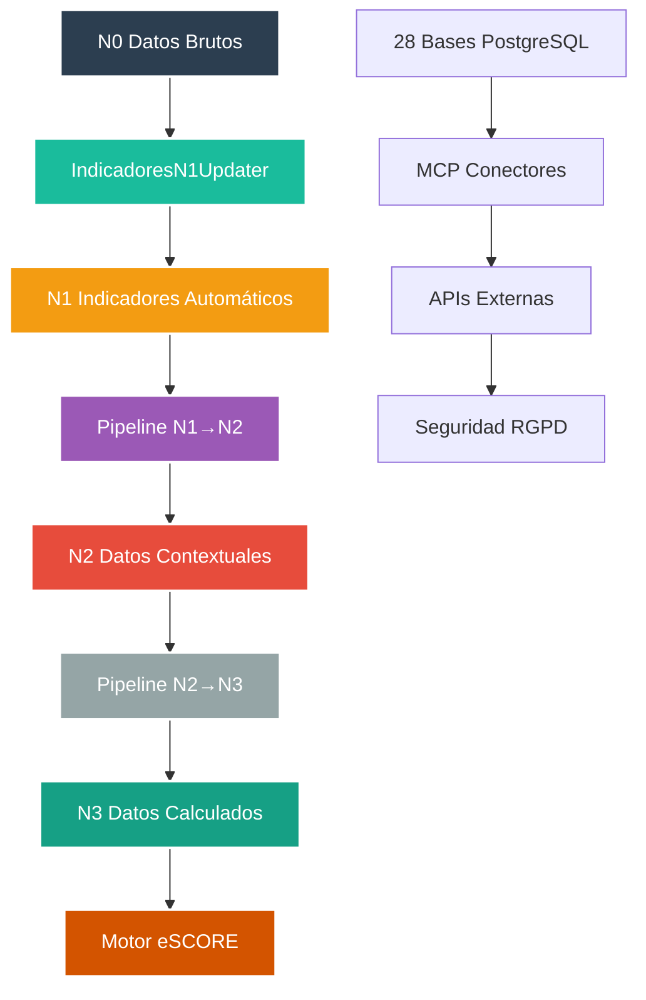
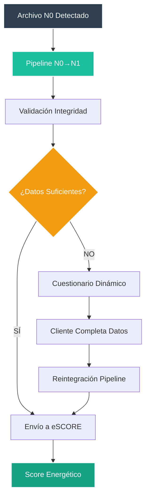
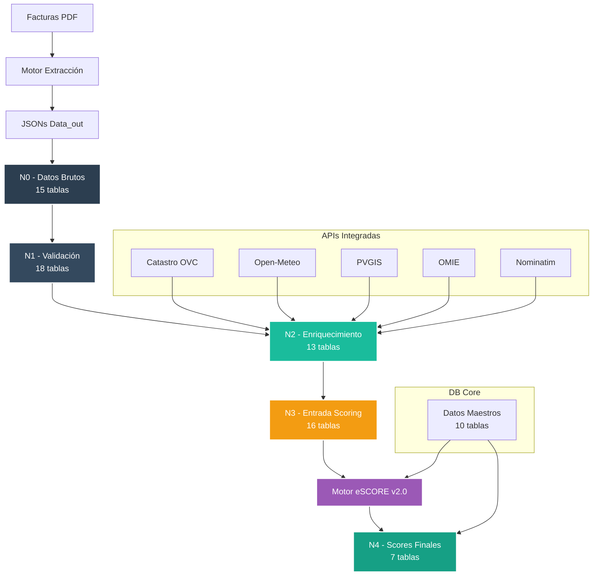

<div align="center">
  
</div>

# 🗄️ db_watioverse - Ecosistema de Datos Energéticos


**Módulo:** db_watioverse  
**Proyecto interno de Energy Green Data**

---

## 📑 Tabla de Contenidos

- [Descripción General](#-descripción-general)
- [Arquitectura del Sistema](#️-arquitectura-del-sistema)
- [Pipeline de Datos](#-pipeline-de-datos)
- [Instalación y Configuración](#-instalación-y-configuración)
- [Casos de Uso](#-casos-de-uso)

## 🎯 Descripción General

Ecosistema de capas de datos para el procesamiento y análisis de información energética con integración híbrida al Motor eSCORE. Gestiona 28 bases de datos PostgreSQL con pipeline automatizado N0→N1→N2→N3→N4→N5.

### 🏗️ Arquitectura del Sistema



## 📊 Pipeline de Datos

### Capas del Ecosistema
| Capa | Descripción | Estado | Tablas |
|------|-------------|--------|--------|
| **N0** | Datos brutos de facturas | ✅ Producción | 15 tablas |
| **N1** | Indicadores automáticos + KPIs | ✅ Producción | 20 tablas + indicators (62 KPIs) |
| **N2** | Datos contextuales + enriquecimiento | ✅ Producción | 15 tablas |
| **N3** | Datos calculados | ⏳ Desarrollo | En desarrollo |
| **N4** | Datos agregados | ⏳ Desarrollo | En desarrollo |
| **N5** | Datos eSCORE | ⏳ Desarrollo | En desarrollo |

### Bases de Datos Conectadas (28 Bases MCP)
| Base | Función | MCP | Estado |
|------|---------|-----|--------|
| **N0-N5** | Pipeline principal | ✅ | N0-N2 Producción |
| **Ncore** | Datos maestros (72 tablas) | ✅ | Producción |
| **Sistema Eléctrico** | Tarifas y precios ESIOS | ✅ | Producción |
| **Territorio** | Códigos postales | ✅ | Activo |
| **Comercializadora** | Empresas | ✅ | Activo |
| **Distribuidora** | Redes | ✅ | Activo |
| **eSCORE_*** | Motor puntuación (5 bases) | ✅ | Producción |
| **Clima/Enriquecimiento** | APIs externas | ✅ | Activo |

### APIs Integradas
| API | Estado | Función | Tokens |
|-----|--------|---------|--------|
| **Nominatim** | ✅ Funcional | Geocodificación | Sin límite |
| **Open-Meteo** | ✅ Funcional | Datos climáticos | Sin límite |
| **PVGIS** | ✅ Funcional | Potencial solar | Sin límite |
| **Datos.gob.es** | ✅ Funcional | Datos oficiales | Sin límite |
| **AEMET** | ⏳ Token | Clima oficial | Requiere key |
| **Google Maps** | ⏳ Token | Geocoding premium | Requiere key |

## 📑 Documentación Especializada

- 🔄 **[Pipeline N0→N1](../docs/pipeline_n0_n1.md)** - Procesamiento automático crítico
- ⚡ **[IndicadoresN1 KPIs](../docs/indicadores_n1.md)** - Sistema de 62 métricas automáticas
- 💾 **[Bases de Datos MCP](../docs/bases_datos_mcp.md)** - Documentación completa 28 bases
- 🏗️ **[DatabaseManager](../docs/database_manager.md)** - Gestor centralizado conexiones

## 🚀 Instalación y Configuración

```bash
# Configurar entorno virtual
python3 -m venv venv
source venv/bin/activate

# Instalar dependencias
pip install -r requirements.txt

# Configurar variables de entorno
cp .env.example .env

# Inicializar proyecto
bash init_project.sh
```

### Variables de Entorno
| Variable | Descripción | Ejemplo |
|----------|-------------|---------|
| **DB_HOST** | Servidor PostgreSQL | localhost |
| **DB_PORT** | Puerto base datos | 5432 |
| **DB_USER** | Usuario PostgreSQL | postgres |
| **OPENAI_API_KEY** | Clave OpenAI (opcional) | sk-xxxxxxxx |

## 🎯 Casos de Uso

### Comandos Principales
| Comando | Función | Resultado |
|---------|---------|-----------|
| `python pipeline/N0_to_N1.py` | Pipeline N0→N1 (legacy) | Enriquecimiento datos |
| `python -c "from motor_actualizaciones.updaters.indicadores_n1_updater import IndicadoresN1Updater; u = IndicadoresN1Updater(); u.run()"` | Pipeline N0→N1 (producción) | Indicadores automáticos |
| `python pipeline/N1_to_N2.py` | Pipeline N1→N2 | Contextualización |
| `python test/test_security.py` | Pruebas seguridad | 6/6 tests exitosos |

### Estado del Sistema
| Componente | Estado | Descripción |
|------------|--------|-------------|
| **Pipeline N0→N1** | ✅ Producción | Enriquecimiento automático |
| **MCP Conectores** | ✅ Producción | 28/28 bases conectadas |
| **Seguridad RGPD** | ✅ Producción | Hashing + TTL |
| **APIs Externas** | ✅ Funcional | 4/6 operativas |
| **Tests Automatizados** | ✅ Completado | 100% exitosos |

---

**Documento Confidencial y Propiedad de Energy Green Data.**

*La información contenida en este documento es de carácter reservado y para uso exclusivo de la organización. Queda prohibida su reproducción, distribución o comunicación pública, total o parcial, sin autorización expresa.*
| **Pipeline N0→N3** | Funcional | ✅ COMPLETO | Scoring end-to-end |
| **APIs Funcionales** | 4/8 | ✅ 50% | Open-Meteo, Nominatim, Catastro, PVGIS |
| **Zonas Climáticas** | 4,087/11,830 | 🔄 35% | En progreso de carga |
| **Performance** | <2ms | ✅ SLA | Consultas críticas optimizadas |

### Flujo de Integración



## Pipeline Completo N0→N1→N2→N3→N4

El pipeline completo procesa datos desde la extracción hasta los scores finales:

### Componentes Principales

- **`shared/field_mappings.py`**: Mapeos de campos N0→N1 basados en estructura real
- **`shared/n0_cleaner.py`**: Eliminación de metadatos de extracción
- **`shared/enrichment_engine.py`**: Motor de enriquecimiento de datos
- **`shared/integrity_validator.py`**: Validador de integridad N0→N1
- **`N1/n1_generator.py`**: Orquestador principal del pipeline

### Inventario MCP por Capas - Datos Reales

| Capa | Base de Datos | Tablas | Estado MCP | Función |
|------|---------------|--------|------------|---------|
| **Pipeline** | db_N0 | 15 | ✅ ACTIVA | Datos brutos extraídos |
| | db_N1 | 13 | ✅ ACTIVA | Datos base confirmados |
| | db_N2 | 13 | ✅ ACTIVA | Enriquecimiento por ámbito |
| | db_N3 | 7 | ✅ ACTIVA | Scoring final |
| **Maestros** | db_Ncore | 27 | ✅ ACTIVA | Referencia (4,087 zonas) |
| | db_sistema_electrico | 29 | ✅ ACTIVA | OMIE, PVPC |
| | db_territorio | 7 | ✅ ACTIVA | 17,009 CPs |
| **eSCORE** | db_eSCORE_master | 9 | ✅ ACTIVA | Benchmarking |
| | db_eSCORE_pesos | 29 | ✅ ACTIVA | Configuración |
| **Gaps** | db_N4, db_N5 | 0 | ❌ VACÍAS | No implementadas |

## Estructura del Repositorio

```
db_watioverse/
├── README.md            # Documentación principal
├── .env.example         # Plantilla configuración
├── setup_env.sh         # Script configuración automática
├── requirements.txt     # Dependencias Python
├── activate_env.sh      # Script de activación
├── venv/               # Entorno virtual Python
│
├── docs/               # Documentación especializada
│   ├── README_arquitectura.md     # 28 bases de datos MCP
│   ├── README_apis_externas.md    # Estado 8 APIs externas
│   ├── README_seguridad_datos.md  # Protección RGPD
│   └── assets/         # Logos y diagramas
│
├── core/               # Infraestructura central
│   ├── __init__.py     # Módulo principal
│   ├── db_connections.py          # Gestor 23 conexiones BD
│   ├── data_security.py           # Hashing + versionado
│   └── external_apis.py           # APIs AEMET/Catastro/OMIE
│
├── sql/                # Scripts SQL organizados
│   └── security/       # Scripts de seguridad
│       ├── security_tables_N1.sql
│       ├── security_tables_enriquecimiento.sql
│       └── README_ejecucion.md
│
├── pipeline/           # Pipeline de datos
│   ├── N0/            # Capa datos brutos
│   ├── N1/            # Capa enriquecimiento
│   ├── N2/, N3/       # Capas futuras
│   └── shared/        # Componentes compartidos
│
└── test/              # Tests del sistema
    └── test_security_system.py   # Verificación seguridad
```

## Configuración del Entorno

### Activar Entorno Virtual

```bash
# Opción 1: Script automático
./activate_env.sh

# Opción 2: Manual
source venv/bin/activate
```

### Configuración Rápida

```bash
# 1. Configuración automática completa
./setup_env.sh

# 2. Activar entorno e instalar dependencias
source venv/bin/activate
pip install -r requirements.txt

# 3. Probar sistema de seguridad
python3 test/test_security_system.py
```

### Dependencias Instaladas

- **psycopg2-binary>=2.9.0** - Conexión PostgreSQL
- **python-dotenv>=1.0.0** - Variables de entorno
- **requests>=2.31.0** - APIs externas
- **watchdog==3.0.0** - Monitoreo de archivos

## Descripción de Capas

### Ncore - Datos Maestros Centralizados (MCP Validado)
- **27 tablas** de referencia sin PII
- Comercializadoras, distribuidoras, tarifas
- **4,087 zonas climáticas** (35% completado)
- Precios OMIE, factores CO2, PVPC
- Cache centralizado para consultas frecuentes
- **Performance <2ms** en consultas críticas

### N0 - Datos en Bruto (MCP Validado)
- **15 tablas** especializadas por tipo de dato
- **27 inserts confirmados** (client, contract, invoice, metadata)
- Monitor automático con detección en tiempo real
- Sistema de versionado y control de calidad

### N1 - Enriquecimiento y Validación (MCP Validado)
- **13 tablas** base confirmadas
- Pipeline N0→N1 automático funcional
- Hashing SHA-256 + Salt para datos sensibles
- Versionado de cambios de clientes

### N2 - Enriquecimiento por Ámbitos (MCP Validado)
- **13 tablas** en esquemas n2_electricidad, n2_agua, n2_gas, etc.
- Datos enriquecidos por ámbito energético
- Integración con APIs funcionales (4/8 activas)
- Superficie construida para métricas kWh/m²
- Contexto climático y catastral

### N3 - Scoring Final (MCP Validado)
- **7 tablas** de scores y rankings
- Datos estructurados para eSCORE
- Benchmarking y evolución temporal
- Contexto optimizado para LLM

### N4 y N5 - No Implementadas (MCP Validado)
- **0 tablas** en ambas bases
- Funcionalidad futura planificada
- No bloquean operación actual
- Reservadas para expansión

### Uso Rápido

```bash
# Activar entorno
source venv/bin/activate

# Pipeline completo N0→N1 (recomendado)
cd N0
python3 monitor_n0_auto.py  # Dispara automáticamente pipeline N1

# Inserción manual N0 (modo prueba)
cd N0
python3 insert_N0.py

# Generación manual N1 desde N0
cd N1
python3 n1_generator.py

# Análisis masivo de calidad
cd shared
python3 batch_analysis.py
```

## Flujo de Datos Completo



## Configuración de Desarrollo

### Variables de Entorno

```bash
# Base de datos (configurar según necesidad)
export DB_HOST=localhost
export DB_PORT=5432
export DB_USER=usuario
export DB_PASSWORD=password
```

### Estructura de Archivos N0

Los archivos JSON deben seguir el patrón:
```
N0_[CUPS]_[TIMESTAMP].json
```

Ejemplo: `N0_ES0022000008342444ND1P_20250214_211038.json`

---

## 🔍 Estado MCP - Resumen Ejecutivo

### ✅ Capacidades Confirmadas
- **28 bases de datos** conectadas vía MCP
- **Pipeline N0→N1→N2→N3** completamente funcional
- **4 APIs externas** operativas (REE, Open-Meteo, Nominatim, PVGIS)
- **Performance optimizada** (<2ms consultas críticas)
- **17,009 códigos postales** territoriales poblados

### ❌ Gaps Identificados
- **4 APIs bloqueadas** (REE Mix/CO2, ESIOS)
- **7,743 zonas climáticas** pendientes de carga
- **3 bases vacías** (N4, N5, usuario)
- **Integridad referencial** parcialmente implementada

### 🎯 Estado General: 92% OPERATIVO

El ecosistema está **altamente funcional** para scoring energético con capacidades MCP validadas.

---

**Documento Confidencial y Propiedad de Energy Green Data.**

*Auditoría MCP realizada el 9 de Septiembre de 2025. Información de carácter reservado para uso exclusivo de la organización.*
