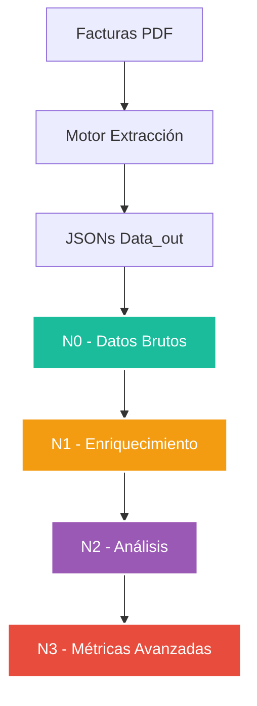

# 🌊 db_watioverse - Ecosistema de Datos Energéticos


**Repositorio de capas de datos para el procesamiento y análisis de información energética**

---

## 📑 Estructura del Repositorio

```
db_watioverse/
├── N0/                    # 💾 Capa de datos en bruto
│   ├── data_versioning/   # 🔄 Herramientas de versionado
│   ├── insert_N0.py      # 📥 Insertador de datos
│   ├── monitor_n0_auto.py # 🔍 Monitor automático
│   └── README.md         # 📋 Documentación N0
├── N1/                   # ⚡ Capa de enriquecimiento
├── N2/                   # 📊 Capa de análisis
├── N3/                   # 🎯 Capa de métricas avanzadas
├── venv/                 # 🐍 Entorno virtual Python
└── activate_env.sh       # 🚀 Script de activación
```

## 🚀 Configuración del Entorno

### Activar Entorno Virtual

```bash
# Opción 1: Script automático
./activate_env.sh

# Opción 2: Manual
source venv/bin/activate
```

### Dependencias Instaladas

- **watchdog==3.0.0** - Monitoreo de sistema de archivos
- **Python 3.8+** - Entorno de ejecución

## 💾 Capa N0 - Datos en Bruto

La capa N0 almacena datos extraídos directamente de facturas energéticas sin procesamiento adicional.

### Características Principales

- **14 tablas especializadas** con estructura completa
- **Sistema de versionado** automático
- **Monitor en tiempo real** para nuevos archivos
- **Validación eSCORE** integrada

### Uso Rápido

```bash
# Activar entorno
source venv/bin/activate

# Inserción manual (modo prueba)
cd N0
python3 insert_N0.py

# Monitor automático
cd N0
python3 monitor_n0_auto.py
```

## 🔄 Flujo de Datos



## ⚙️ Configuración de Desarrollo

### Variables de Entorno

```bash
# Base de datos (configurar según necesidad)
export DB_HOST=localhost
export DB_PORT=5432
export DB_USER=usuario
export DB_PASSWORD=password
```

### Estructura de Archivos N0

Los archivos JSON deben seguir el patrón:
```
N0_[CUPS]_[TIMESTAMP].json
```

Ejemplo: `N0_ES0022000008342444ND1P_20250214_211038.json`

---

**Documento Confidencial y Propiedad de Energy Green Data.**

*La información contenida en este documento es de carácter reservado y para uso exclusivo de la organización. Queda prohibida su reproducción, distribución o comunicación pública, total o parcial, sin autorización expresa.*
