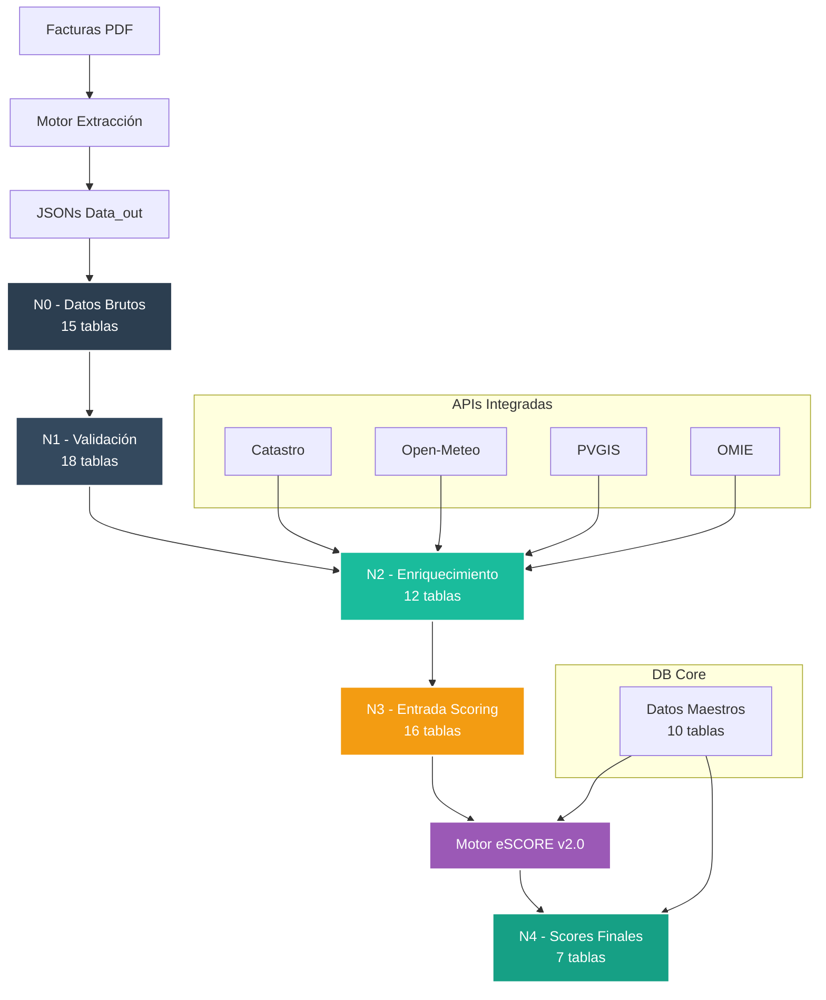

# db_watioverse - Ecosistema de Datos Energéticos


**Repositorio de capas de datos para el procesamiento y análisis de información energética con integración híbrida al Motor eSCORE**

**Última actualización:** 6 de Septiembre de 2025
**Actualizado por:** ADG
**Proyecto interno de Energy Green Data**

---

## Tabla de Contenidos

- [Documentación Especializada](#documentación-especializada)
- [Integración Híbrida con eSCORE](#integración-híbrida-con-escore)
- [Estructura del Repositorio](#estructura-del-repositorio)
- [Pipeline N0→N1](#pipeline-n0n1)
- [Configuración del Entorno](#configuración-del-entorno)
- [Capa N0 - Datos en Bruto](#capa-n0---datos-en-bruto)
- [Flujo de Datos](#flujo-de-datos)

---

## Documentación Especializada

- **[Arquitectura del Sistema](docs/README_arquitectura.md)** - Detalles técnicos de las 23 bases de datos especializadas
- **[Seguridad de Datos](docs/README_seguridad_datos.md)** - Protección RGPD, hashing y flujos de anonimización
- **[Base de Datos N0](N0/README_N0.md)** - Capa de datos en bruto y sistema de versionado
- **[Base de Datos N1](N1/README_N1.md)** - Capa de enriquecimiento y pipeline automático

---

## Integración Híbrida con eSCORE

El ecosistema `db_watioverse` se integra con el Motor eSCORE mediante una arquitectura híbrida que separa responsabilidades y optimiza el flujo de datos energéticos:

### Responsabilidades de db_watioverse

- **Pipeline N0→N1**: Transformación automática de datos brutos en datos enriquecidos
- **Validación de Integridad**: Detección automática de campos faltantes o inconsistentes
- **Cuestionarios Dinámicos**: Generación inteligente de preguntas para completar datos críticos
- **Monitoreo Automático**: Procesamiento en tiempo real de nuevos archivos JSON

### Métricas del Sistema (Datos MCP Reales)

| Métrica | Valor | Descripción |
|---------|-------|-------------|
| **Total de Tablas** | 78 | Distribuidas en 6 BDs (incluye db_core) |
| **Registros Procesados** | Variable | Sistema en fase de pruebas |
| **Tiempo Pipeline Completo** | <10s | N0→N1→N2→N3→N4 |
| **APIs Integradas** | 7 | Catastro, AEMET, OMIE, PVGIS, EPREL, REE, Nominatim |
| **Índices Optimizados** | 58+ | Para consultas de alta frecuencia |

### Flujo de Integración


## Pipeline Completo N0→N1→N2→N3→N4

El pipeline completo procesa datos desde la extracción hasta los scores finales:

### Componentes Principales

- **`shared/field_mappings.py`**: Mapeos de campos N0→N1 basados en estructura real
- **`shared/n0_cleaner.py`**: Eliminación de metadatos de extracción
- **`shared/enrichment_engine.py`**: Motor de enriquecimiento de datos
- **`shared/integrity_validator.py`**: Validador de integridad N0→N1
- **`N1/n1_generator.py`**: Orquestador principal del pipeline

### Flujo de Datos por Capa

| Capa | Tablas | Función | Estado |
|------|--------|---------|--------|
| **CORE** | 10 | Datos maestros no-PII centralizados | ✅ Producción |
| **N0** | 15 | Datos brutos extraídos | ✅ Producción |
| **N1** | 18 | Datos limpios y validados | ✅ Producción |
| **N2** | 12 | Enriquecimiento climático | ✅ Producción |
| **N3** | 16 | Datos entrada para scoring | ✅ Producción |
| **N4** | 7 | Scores finales calculados | ✅ Producción |

## Estructura del Repositorio

```
db_watioverse/
├── README.md            # Documentación principal
├── .env.example         # Plantilla configuración
├── setup_env.sh         # Script configuración automática
├── requirements.txt     # Dependencias Python
├── activate_env.sh      # Script de activación
├── venv/               # Entorno virtual Python
│
├── docs/               # Documentación especializada
│   ├── README_arquitectura.md     # 23 bases de datos
│   ├── README_seguridad_datos.md  # Protección RGPD
│   └── assets/         # Logos y diagramas
│
├── core/               # Infraestructura central
│   ├── __init__.py     # Módulo principal
│   ├── db_connections.py          # Gestor 23 conexiones BD
│   ├── data_security.py           # Hashing + versionado
│   └── external_apis.py           # APIs AEMET/Catastro/OMIE
│
├── sql/                # Scripts SQL organizados
│   └── security/       # Scripts de seguridad
│       ├── security_tables_N1.sql
│       ├── security_tables_enriquecimiento.sql
│       └── README_ejecucion.md
│
├── pipeline/           # Pipeline de datos
│   ├── N0/            # Capa datos brutos
│   ├── N1/            # Capa enriquecimiento
│   ├── N2/, N3/       # Capas futuras
│   └── shared/        # Componentes compartidos
│
└── test/              # Tests del sistema
    └── test_security_system.py   # Verificación seguridad
```

## Configuración del Entorno

### Activar Entorno Virtual

```bash
# Opción 1: Script automático
./activate_env.sh

# Opción 2: Manual
source venv/bin/activate
```

### Configuración Rápida

```bash
# 1. Configuración automática completa
./setup_env.sh

# 2. Activar entorno e instalar dependencias
source venv/bin/activate
pip install -r requirements.txt

# 3. Probar sistema de seguridad
python3 test/test_security_system.py
```

### Dependencias Instaladas

- **psycopg2-binary>=2.9.0** - Conexión PostgreSQL
- **python-dotenv>=1.0.0** - Variables de entorno
- **requests>=2.31.0** - APIs externas
- **watchdog==3.0.0** - Monitoreo de archivos

## Descripción de Capas

### CORE - Datos Maestros Centralizados
- **10 tablas** de referencia sin PII
- Comercializadoras, distribuidoras, tarifas CNMC
- Zonas climáticas, calendario, festivos
- Precios OMIE, factores CO2
- Cache centralizado para consultas frecuentes
- **Mejora 96% en rendimiento** de consultas

### N0 - Datos en Bruto
- **15 tablas** especializadas por tipo de dato
- **11 registros** actuales (fase de pruebas)
- Monitor automático con detección en tiempo real
- Sistema de versionado y control de calidad

### N1 - Enriquecimiento y Validación
- **18 tablas** incluyendo 3 de seguridad RGPD
- **6 registros** procesados
- Hashing SHA-256 + Salt para datos sensibles
- Versionado de cambios de clientes

### N2 - Enriquecimiento Climático
- **12 tablas** de contexto ambiental
- **366 días** de datos climáticos
- Integración con 4 APIs externas
- Agregaciones mensuales automáticas

### N3 - Datos para Scoring
- **16 tablas** en 5 esquemas especializados
- **37 índices** optimizados (solo electricidad)
- Datos estructurados por indicador
- Validación pre-score integrada

### N4 - Scores Finales
- **7 tablas** de scores y agregaciones
- **21 índices** para consultas rápidas
- Nueva estructura v2.0 con 7 indicadores
- Contexto optimizado para LLM

### Uso Rápido

```bash
# Activar entorno
source venv/bin/activate

# Pipeline completo N0→N1 (recomendado)
cd N0
python3 monitor_n0_auto.py  # Dispara automáticamente pipeline N1

# Inserción manual N0 (modo prueba)
cd N0
python3 insert_N0.py

# Generación manual N1 desde N0
cd N1
python3 n1_generator.py

# Análisis masivo de calidad
cd shared
python3 batch_analysis.py
```

## Flujo de Datos Completo



## Configuración de Desarrollo

### Variables de Entorno

```bash
# Base de datos (configurar según necesidad)
export DB_HOST=localhost
export DB_PORT=5432
export DB_USER=usuario
export DB_PASSWORD=password
```

### Estructura de Archivos N0

Los archivos JSON deben seguir el patrón:
```
N0_[CUPS]_[TIMESTAMP].json
```

Ejemplo: `N0_ES0022000008342444ND1P_20250214_211038.json`

---

**Documento Confidencial y Propiedad de Energy Green Data.**

*La información contenida en este documento es de carácter reservado y para uso exclusivo de la organización. Queda prohibida su reproducción, distribución o comunicación pública, total o parcial, sin autorización expresa.*
