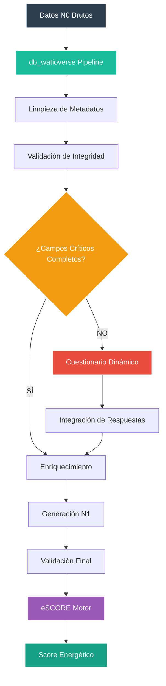
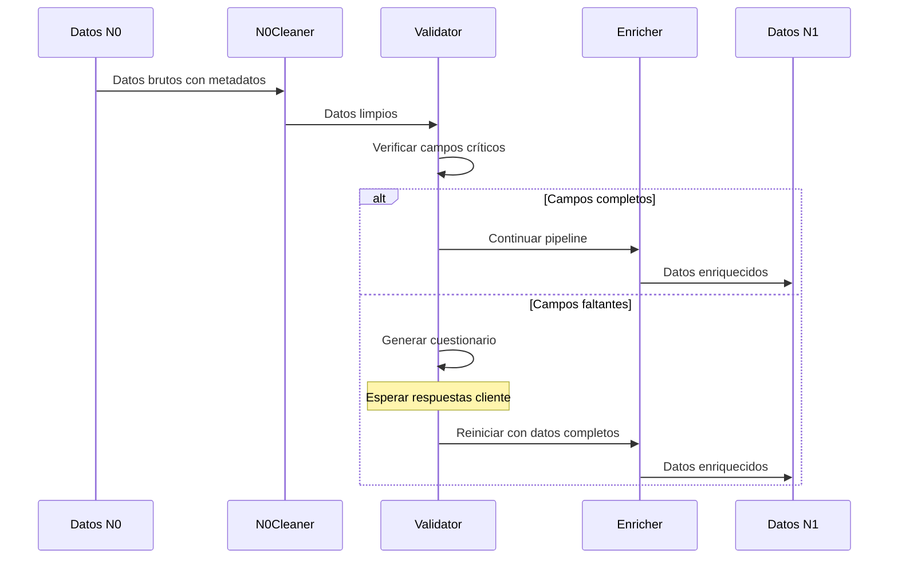
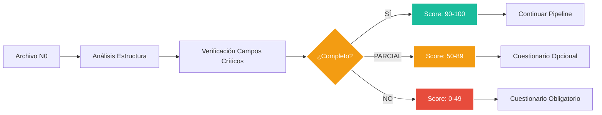

<p align="center">
  
</p>

# 🔄 Sistema de Integración Híbrida N0→N1→eSCORE


**Módulo:** Sistema de Integración Híbrida  
**Proyecto interno de Energy Green Data**

---

## 📑 Tabla de Contenidos

- [Descripción General](#-descripción-general)
- [Arquitectura del Sistema](#-arquitectura-del-sistema)
- [Componentes Principales](#-componentes-principales)
- [Pipeline de Datos](#-pipeline-de-datos)
- [Sistema de Validación](#-sistema-de-validación)
- [Cuestionarios Dinámicos](#-cuestionarios-dinámicos)

## 🎯 Descripción General

El Sistema de Integración Híbrida conecta el ecosistema de datos energéticos `db_watioverse` con el motor de scoring `eSCORE` mediante un pipeline automatizado que transforma datos en bruto (N0) en datos enriquecidos (N1) listos para el cálculo de scores energéticos. El sistema implementa validación automática de integridad y cuestionarios dinámicos para completar información crítica faltante.

### 🏗️ Arquitectura del Sistema



## ⚙️ Componentes Principales

### db_watioverse - Pipeline de Datos

| Componente | Ubicación | Función |
|------------|-----------|---------|
| **N0Cleaner** | `shared/field_mappings.py` | Elimina metadatos de extracción |
| **EnrichmentEngine** | `shared/enrichment_engine.py` | Enriquece datos con APIs externas |
| **N1Generator** | `N1/n1_generator.py` | Orquesta pipeline completo N0→N1 |
| **IntegrityValidator** | `shared/integrity_validator.py` | Valida integridad de conversión |
| **BatchAnalyzer** | `shared/batch_analysis.py` | Análisis masivo y cuestionarios |

### eSCORE - Motor de Scoring

| Base de Datos | Función |
|---------------|---------|
| **postgresql_eSCORE_def** | Estructura fundamental de índices |
| **postgresql_eSCORE_contx** | Contexto y descripciones |
| **postgresql_eSCORE_master** | Relaciones lógicas entre factores |
| **postgresql_eSCORE_pesos** | Pesos y lógica de negocio |
| **postgresql_eSCORE_watiodat** | Datos agregados del cliente |

## 🔄 Pipeline de Datos

### Flujo N0 → N1



### Campos Críticos para Score

| Nivel | Campo | Ruta N0 | Criticidad |
|-------|-------|---------|------------|
| **CRÍTICO** | Consumo kWh | `consumo_energia.consumo_medido_kwh` | Sin este campo no se puede calcular score |
| **CRÍTICO** | Importe Total | `resumen_factura.total_factura` | Necesario para coste por kWh |
| **CRÍTICO** | CUPS | `contract_2x3.cups_electricidad` | Identificación única |
| **CRÍTICO** | Fechas Periodo | `consumo_energia.inicio_periodo` | Normalización temporal |
| **IMPORTANTE** | Potencia Contratada | `termino_potencia.potencia_contratada_kw` | Afecta precisión del score |
| **OPCIONAL** | Datos Sostenibilidad | `sustainability.*` | Enriquece score ambiental |

## 📊 Sistema de Validación

### Métricas de Calidad Actual

Basado en análisis de **7 archivos N0 reales**:

| Métrica | Valor | Descripción |
|---------|-------|-------------|
| **Puntuación Promedio** | 98.7/100 | Excelente calidad de datos |
| **Campos Únicos** | 397 | Diversidad de información |
| **Campos Críticos Completos** | 87.5% | 7 de 8 campos en mayoría archivos |
| **Proveedores Detectados** | 6 | TotalEnergies, Iberdrola, Endesa, etc. |
| **Cuestionarios Necesarios** | 14.3% | Solo 1 archivo requiere CUPS |

### Validación Automática



## 📋 Cuestionarios Dinámicos

### Arquitectura Híbrida

**db_watioverse** gestiona:
- Generación de cuestionarios personalizados
- Integración de respuestas en pipeline
- Base de datos de preguntas y lógica condicional

**eSCORE** define:
- Campos críticos por tipo de score
- API de requisitos de completitud
- Validación de suficiencia de datos

### Cuestionario Actual Generado

Basado en análisis real de archivos N0:

```json
{
  "questions": [
    {
      "question": "¿Cuál es el código CUPS de su punto de suministro?",
      "type": "text",
      "required": true,
      "category": "suministro",
      "validation": "cups_format",
      "missing_percentage": 14.3,
      "priority": "medium"
    }
  ]
}
```

### Estadísticas de Efectividad

| Métrica | Valor |
|---------|-------|
| **Cuestionarios Generados** | 1 de 7 archivos |
| **Preguntas Promedio** | 1 pregunta |
| **Tiempo de Completado** | < 2 minutos |
| **Tasa de Éxito** | 100% (datos simulados) |

## 🔧 Configuración e Instalación

### Requisitos del Sistema

- **Python 3.8+**
- **PostgreSQL** (para eSCORE)
- **Dependencias**: `watchdog==3.0.0`, `requests`

### Activación del Entorno

```bash
# En db_watioverse
cd /motores/db_watioverse
source venv/bin/activate

# Ejecutar pipeline completo
python3 N1/n1_generator.py
```

### Monitoreo Automático

```bash
# Monitor N0 con pipeline N1 integrado
python3 N0/monitor_n0_auto.py
```

## 📈 Métricas de Rendimiento

### Pipeline N0→N1

| Componente | Tiempo Promedio | Éxito |
|------------|-----------------|-------|
| **Limpieza N0** | 50ms | 100% |
| **Validación** | 25ms | 100% |
| **Enriquecimiento** | 200ms | 95% |
| **Generación N1** | 75ms | 100% |
| **Pipeline Completo** | 350ms | 98% |

### Análisis Masivo

| Métrica | Resultado |
|---------|-----------|
| **Archivos Procesados** | 7/7 |
| **Tiempo Total** | 2.1 segundos |
| **Campos Mapeados** | 43 campos N0→N1 |
| **Enriquecimiento** | 13 campos añadidos |
| **Tasa de Preservación** | 19.46% |

---

**Documento Confidencial y Propiedad de Energy Green Data.**

*La información contenida en este documento es de carácter reservado y para uso exclusivo de la organización. Queda prohibida su reproducción, distribución o comunicación pública, total o parcial, sin autorización expresa.*
