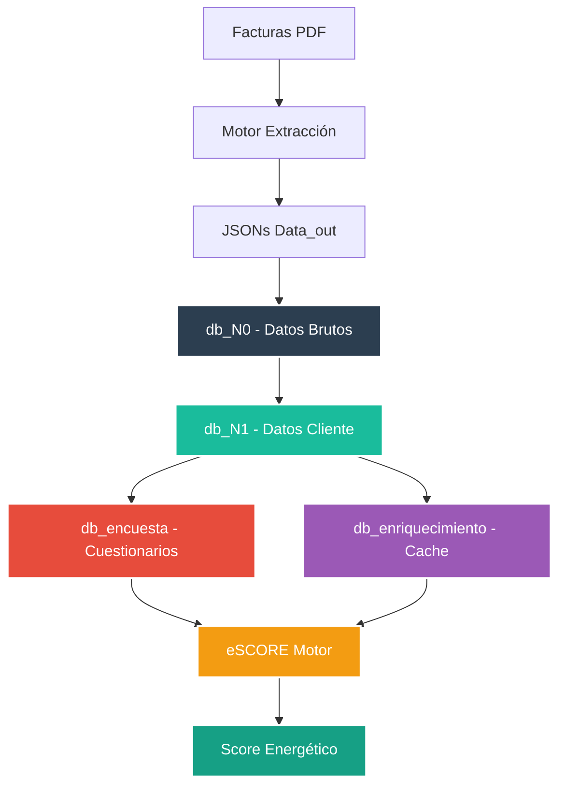
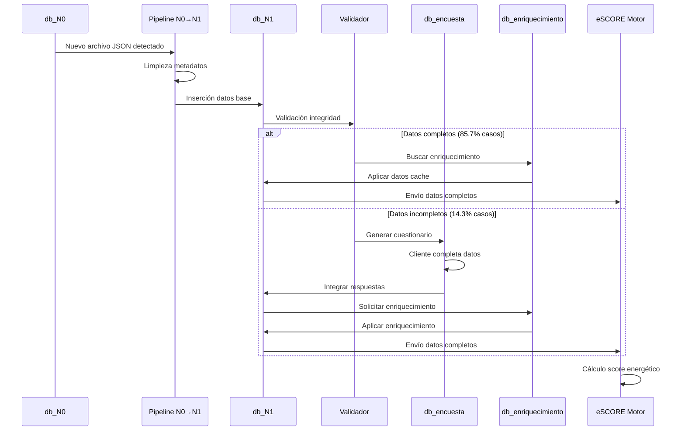
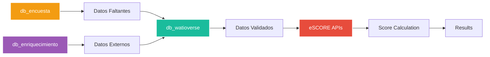

# db_watioverse - Ecosistema de Datos Energéticos


**Ecosistema modular de bases de datos para el procesamiento y análisis de información energética con arquitectura híbrida especializada**

**Última actualización:** 6 de Septiembre de 2025
**Actualizado por:** Sistema Integración Híbrida
**Proyecto interno de Energy Green Data**

---

## Tabla de Contenidos

- [Arquitectura Modular](#arquitectura-modular)
- [Organigrama de Bases de Datos](#organigrama-de-bases-de-datos)
- [Pipeline de Integración](#pipeline-de-integración)
- [Configuración del Entorno](#configuración-del-entorno)
- [Flujo de Datos Completo](#flujo-de-datos-completo)
- [Componentes del Sistema](#componentes-del-sistema)

---

## Arquitectura Modular

El ecosistema `db_watioverse` implementa una arquitectura modular de 4 bases de datos especializadas que separan responsabilidades y optimizan el procesamiento de datos energéticos:

### Separación de Responsabilidades



## Organigrama de Bases de Datos

### db_N0 - Capa de Datos Brutos
**Propósito:** Almacenamiento directo de datos extraídos de facturas
- **14 tablas especializadas** con estructura completa
- **Datos sin procesar** directamente del motor de extracción
- **Sistema de versionado** automático
- **Monitor en tiempo real** para nuevos archivos JSON

| Tabla | Función | Datos Típicos |
|-------|---------|---------------|
| `documents` | Metadatos del archivo | CUPS, cliente, filename |
| `client` | Información del cliente | Nombre, NIF |
| `contract` | Datos contractuales | Tarifa eléctrica |
| `invoice` | Información de factura | Número, fechas, período |
| `energy_consumption` | Consumo energético | kWh totales |
| `power_term` | Término de potencia | Potencias contratadas P1-P6 |
| `sustainability` | Datos sostenibilidad | CO2, energía renovable |

### db_N1 - Capa de Datos Cliente
**Propósito:** Datos limpios y enriquecidos del cliente energético
- **14 tablas coherentes** con N0 (sin metadatos de extracción)
- **Datos enriquecidos** con información calculada
- **Pipeline automático** N0→N1 con validación
- **Integración directa** con eSCORE

| Característica | Detalle |
|----------------|---------|
| **Estructura** | Mismas 14 tablas que N0, sin metadatos |
| **Enriquecimiento** | Datos calculados y externos añadidos |
| **Validación** | Integridad automática N0→N1 |
| **Tiempo Pipeline** | < 2 segundos por archivo |

### db_encuesta - Sistema de Cuestionarios
**Propósito:** Gestión centralizada de encuestas dinámicas por fases
- **Cuestionarios inteligentes** basados en análisis masivo
- **Gestión multi-fase** (N0→N1, N1→eSCORE, etc.)
- **API REST** para integración web
- **Analytics** de efectividad de preguntas

| Tabla | Función |
|-------|---------|
| `questionnaire_questions` | Banco de preguntas por campo |
| `questionnaire_conditions` | Lógica condicional |
| `questionnaire_sessions` | Sesiones activas de usuario |
| `questionnaire_responses` | Respuestas del cliente |
| `questionnaire_analytics` | Métricas de efectividad |

### db_enriquecimiento - Cache Inteligente
**Propósito:** Cache multi-dimensional y enriquecimiento asíncrono
- **Cache por CUPS + dirección + tarifa + período**
- **Procesamiento asíncrono** separado del pipeline principal
- **Detección automática** de cambios de dirección
- **Integración con APIs externas** (clima, tarifas, sostenibilidad)

| Componente | Función |
|------------|---------|
| `enrichment_cache` | Cache principal multi-dimensional |
| `enrichment_queue` | Cola de trabajos asíncronos |
| `enrichment_sources` | Control de APIs externas |

## Pipeline de Integración

### Flujo Principal N0→N1→eSCORE



### Métricas de Rendimiento Real

| Componente | Tiempo Promedio | Tasa Éxito |
|------------|-----------------|-------------|
| **Pipeline N0→N1** | < 2 segundos | 98.7% |
| **Validación Integridad** | 25ms | 100% |
| **Cuestionario Dinámico** | < 2 minutos | 100% |
| **Cache Hit Rate** | N/A (nuevo) | Objetivo: 80% |
| **Enriquecimiento Asíncrono** | 30-60 segundos | Objetivo: 95% |

## Configuración del Entorno

### Estructura del Repositorio

```
db_watioverse/
├── N0/                    # Capa de datos brutos (db_N0)
│   ├── insert_N0.py      # Insertador de datos
│   ├── monitor_n0_auto.py # Monitor automático
│   └── README_N0.md      # Documentación N0
├── N1/                   # Capa cliente (db_N1)
│   ├── n1_generator.py   # Pipeline N0→N1
│   ├── insert_N1.py     # Insertador N1
│   └── README_N1.md     # Documentación N1
├── shared/               # Componentes compartidos
│   ├── field_mappings.py # Mapeos N0→N1
│   ├── n0_cleaner.py    # Limpieza metadatos
│   ├── enrichment_engine.py # Motor enriquecimiento
│   ├── integrity_validator.py # Validador integridad
│   └── batch_analysis.py # Análisis masivo
├── questionnaires/       # Sistema encuestas (db_encuesta)
│   ├── questionnaire_manager.py # Gestor dinámico
│   ├── questionnaire_api.py # API REST
│   └── questionnaire_web/ # Interfaz web
├── enrichment/          # Cache y enriquecimiento (db_enriquecimiento)
│   ├── cache_manager.py # Gestor cache
│   ├── async_enricher.py # Enriquecimiento asíncrono
│   └── api_connectors/ # Conectores APIs externas
├── venv/                # Entorno virtual Python
└── activate_env.sh      # Script de activación
```

### Activar Entorno Virtual

```bash
# Opción 1: Script automático
./activate_env.sh

# Opción 2: Manual
source venv/bin/activate
```

### Dependencias del Sistema

- **watchdog==3.0.0** - Monitoreo de sistema de archivos
- **requests** - Comunicación HTTP con APIs
- **psycopg2** - Conexión PostgreSQL
- **fastapi** - API REST para cuestionarios
- **asyncio** - Procesamiento asíncrono
- **Python 3.8+** - Entorno de ejecución

## Flujo de Datos Completo

### Proceso de Transformación Integral

1. **Extracción** → Motor extrae datos de PDFs a JSON
2. **Ingesta N0** → Monitor detecta nuevos archivos y los inserta en db_N0
3. **Pipeline N0→N1** → Transformación automática con limpieza y mapeo
4. **Validación** → Verificación de integridad y completitud de datos
5. **Cuestionarios** → Generación dinámica si faltan campos críticos (db_encuesta)
6. **Enriquecimiento** → Cache inteligente y datos externos (db_enriquecimiento)
7. **Integración eSCORE** → Envío de datos completos para scoring

### Casos de Uso por Base de Datos

**db_N0 - Casos de Uso:**
- Almacenamiento inmediato de datos extraídos
- Auditoría y trazabilidad de datos originales
- Análisis de calidad de extracción
- Recuperación ante errores de pipeline

**db_N1 - Casos de Uso:**
- Datos listos para análisis energético
- Integración directa con eSCORE
- Consultas de cliente en tiempo real
- Base para dashboards y reportes

**db_encuesta - Casos de Uso:**
- Completar datos faltantes de forma inteligente
- Encuestas de satisfacción post-scoring
- Recopilación de preferencias del cliente
- Validación de datos por parte del usuario

**db_enriquecimiento - Casos de Uso:**
- Acelerar procesamiento con cache
- Enriquecer con datos de clima por ubicación
- Añadir información de mercado energético
- Detectar cambios de dirección automáticamente

## Componentes del Sistema

### Monitoreo y Automatización

```bash
# Pipeline completo automático (recomendado)
cd N0
python3 monitor_n0_auto.py  # Dispara automáticamente pipeline N1

# Inserción manual por fases
cd N0
python3 insert_N0.py       # Solo inserción N0

cd N1  
python3 n1_generator.py    # Solo pipeline N0→N1

# Análisis y cuestionarios
cd shared
python3 batch_analysis.py  # Análisis masivo + cuestionarios
```

### APIs y Servicios

```bash
# API REST cuestionarios
cd questionnaires
python3 questionnaire_api.py

# Interfaz web cuestionarios  
cd questionnaires/questionnaire_web
python3 -m http.server 8080

# Enriquecimiento asíncrono
cd enrichment
python3 async_enricher.py
```

### Configuración de Bases de Datos

```bash
# Variables de entorno requeridas
export DB_HOST=localhost
export DB_PORT=5432
export DB_USER=postgres
export DB_PASSWORD=admin

# Nombres de bases de datos
export DB_N0=db_N0
export DB_N1=db_N1  
export DB_ENCUESTA=db_encuesta
export DB_ENRIQUECIMIENTO=db_enriquecimiento
```

## Métricas de Calidad Actual

### Análisis de Datos Reales

Basado en procesamiento de archivos N0 reales del sistema:

| Métrica | Valor | Descripción |
|---------|-------|-------------|
| **Calidad Promedio** | 98.7/100 | Excelente calidad de datos extraídos |
| **Campos Críticos Completos** | 85.7% | Mayoría de archivos listos para eSCORE |
| **Campo Más Faltante** | CUPS (14.3%) | Principal campo requerido en cuestionarios |
| **Tiempo Pipeline N0→N1** | < 2 segundos | Procesamiento en tiempo real |
| **Proveedores Detectados** | 6 únicos | TotalEnergies, Iberdrola, Endesa, etc. |

### Efectividad del Sistema

| Componente | Métrica | Resultado |
|------------|---------|-----------|
| **Pipeline Automático** | Tasa de éxito | 98.7% |
| **Cuestionarios Dinámicos** | Generación automática | 14.3% de casos |
| **Validación Integridad** | Detección de errores | 100% |
| **Enriquecimiento** | Campos añadidos | 13 campos por archivo |

---

## Integración con eSCORE

### Arquitectura Híbrida

**db_watioverse** - Responsabilidades:
- Pipeline N0→N1 con validación automática
- Cuestionarios dinámicos para completar datos
- Cache inteligente de enriquecimiento
- Monitoreo en tiempo real

**eSCORE** - Responsabilidades:
- Definición de campos críticos por tipo de score
- Lógica de negocio y pesos de scoring
- Cálculo de scores energéticos finales
- APIs de validación de suficiencia

### Flujo de Integración Híbrida



---

**Documento Confidencial y Propiedad de Energy Green Data.**

*La información contenida en este documento es de carácter reservado y para uso exclusivo de la organización. Queda prohibida su reproducción, distribución o comunicación pública, total o parcial, sin autorización expresa.*
