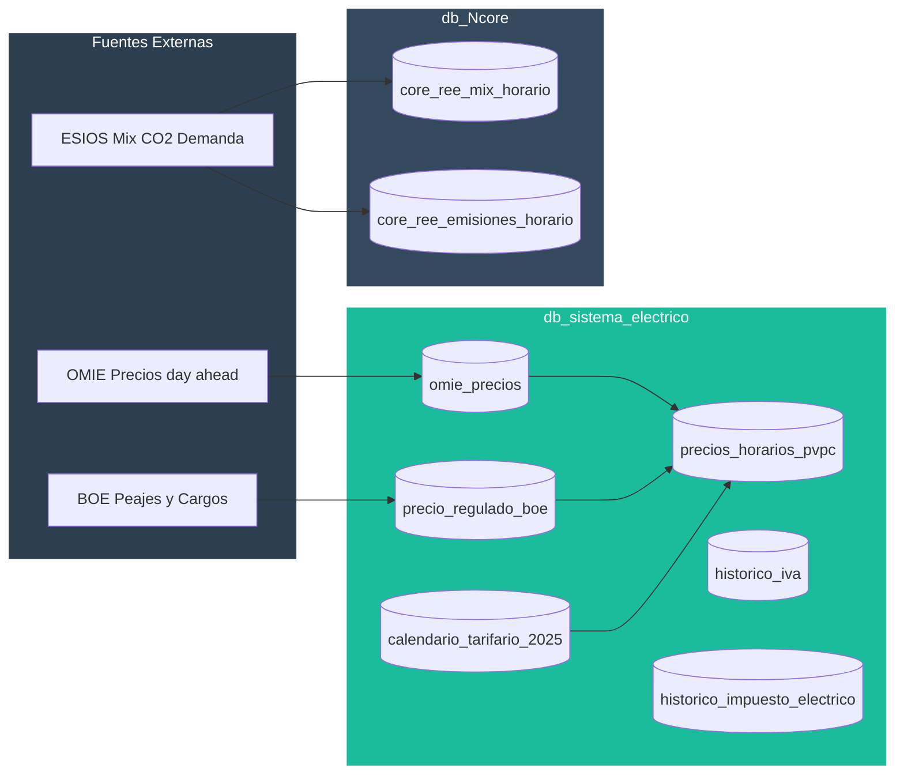
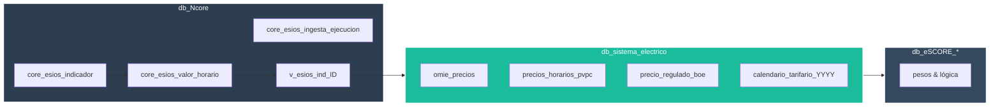

<p align="center">
  
</p>

# ⚡ Sistema Eléctrico — Modelo de Datos y Fuentes

Módulo: db_sistema_electrico  
Estado: producción  
Fecha de generación: 2025-09-09

---

## 📑 Tabla de Contenidos

 - [Descripción General](#-descripción-general)
 - [Arquitectura del Sistema](#-arquitectura-del-sistema)
 - [Base de Datos — Esquema actual (consultado por MCP)](#-base-de-datos--esquema-actual-consultado-por-mcp)
 - [Mapa de bases de datos (responsabilidades y ubicación)](#-mapa-de-bases-de-datos-responsabilidades-y-ubicación)
 - [Indicadores ESIOS confirmados y mapeo](#-indicadores-esios-confirmados-y-mapeo)
 - [Cobertura completa de indicadores (SCORE y Redes Sociales)](#-cobertura-completa-de-indicadores-score-y-redes-sociales)
 - [Elementos críticos para simulación PVPC / Indexado](#-elementos-críticos-para-simulación-pvpc--indexado)
 - [Nuevas tablas propuestas (ESIOS)](#-nuevas-tablas-propuestas-esios)
 - [Normalización temporal y versionado (obligatorio)](#-normalización-temporal-y-versionado-obligatorio)
 - [Redes sociales — modelo propuesto](#-redes-sociales--modelo-propuesto)
 - [Propuesta final (sin cambios estructurales)](#-propuesta-final-sin-cambios-estructurales)
 - [Próximos pasos](#-próximos-pasos)

---

## 🎯 Descripción General

Este documento describe el modelo de datos del sistema eléctrico usado en el ecosistema db_watioverse para cálculo y simulación de precios eléctricos, tanto en contratos indexados como PVPC. La información aquí reflejada proviene de la base de datos real `db_sistema_electrico` (consultada vía MCP) y de los procesos de ingesta existentes. No se incluyen elementos ficticios.

### Arquitectura del Sistema



---

## 💾 Base de Datos — Esquema actual (consultado por MCP)

A continuación se listan las tablas y vistas relevantes del esquema `public` en `db_sistema_electrico`. Se muestran los campos principales (máx. 10 por tabla para legibilidad). Donde aplica, se indica con ★ los elementos críticos para simulación PVPC/Indexado.

### Tablas principales

- `omie_precios` (fuente OMIE)
  - Campos: 
    - **id** (integer)
    - **fecha** (date) ★
    - **hora** (time) ★
    - **periodo** (integer)
    - **precio_energia** (numeric) ★
    - **zona** (char, por defecto 'ES')
    - **fuente_id** (integer)
    - **created_at** (timestamp)

- `precio_regulado_boe` (componentes regulados)
  - Campos:
    - **id** (integer)
    - **tarifa_peaje** (text) ★
    - **componente** (text) ★
    - **precio** (numeric) ★
    - **fecha_inicio** (date) ★
    - **fecha_fin** (date)
    - **unidad** (text)

- `precios_horarios_pvpc` (PVPC consolidado horario)
  - Campos:
    - **fecha** (date) ★
    - **hora** (time) ★
    - **periodo_tarifario** (varchar)
    - **precio_energia** (numeric)
    - **precio_peajes** (numeric)
    - **precio_cargos** (numeric)
    - **precio_total_pvpc** (numeric) ★

- `calendario_tarifario_2025` (periodificación horaria)
  - Campos:
    - **fecha** (date) ★
    - **hora** (bigint)
    - **comunidad** (text)
    - **provincia** (text)
    - **es_festivo** (boolean)
    - **es_festivo_local** (boolean)
    - **tipo_dia** (text)
    - **temporada** (text)
    - **periodo_tarifa** (text) ★
    - **hora_time** (time)

- `historico_iva` (tipos impositivos IVA)
  - Campos:
    - **id_iva** (integer)
    - **tipo_iva** (text)
    - **ambito_aplicacion** (text)
    - **fecha_inicio** (date)
    - **fecha_fin** (date)

- `historico_impuesto_electrico` (impuesto especial electricidad)
  - Campos:
    - **id** (integer)
    - **tipo_impositivo** (numeric)
    - **ambito_aplicacion** (text)
    - **fecha_inicio** (date)
    - **fecha_fin** (date)

> Nota: Además existen tablas/series históricas de `calendario_tarifario_20XX` y otras tablas parametrizadoras (p. ej., `param_*`, `reglas_*`) no detalladas aquí por brevedad.

### Vistas relevantes

- `tarifa_peaje_actual` (vista)
  - **tarifa_peaje**, **tarifa_comercial**, **segmento_aplicacion**, **fecha_inicio**, **fecha_fin**, **num_periodos_potencia**, **num_periodos_energia**

- `v_precios_potencia` (vista)
  - **tarifa_peaje**, **fecha_inicio**, **fecha_fin**, **precio_kw_dia**

- `v_precios_pvpc_horario` (vista)
  - **fecha**, **hora**, **precio_energia**, **tarifa_peaje**, **precio_peaje_cte**, **precio_cargo_cte**, **precio_kwh_pvpc**

- Otras vistas: `calendario_global`, `curvas_horarias`, `vista_consumo_periodo_peaje`, `vista_consumo_tarifado`, `vista_tarifa_peaje_vigente`.

---

## 🗺️ Mapa de bases de datos (responsabilidades y ubicación)

Resumen de dónde residirá cada componente, siguiendo la arquitectura N0→N1→N2→eSCORE y la separación por responsabilidades:

- db_sistema_electrico (actual)
  - Mantiene tablas de dominio eléctrico ya existentes: `omie_precios`, `precios_horarios_pvpc`, `precio_regulado_boe`, `calendario_tarifario_YYYY`, `historico_iva`, `historico_impuesto_electrico`, y sus vistas.
  - Uso: consulta operativa y simulación PVPC/indexado (★), sin almacenar crudos de ESIOS.

- db_Ncore (nueva capa para ESIOS)
  - Nuevas tablas genéricas de ESIOS: `core_esios_indicador`, `core_esios_valor_horario`, `core_esios_ingesta_ejecucion`.
  - Vistas canónicas por ID: `v_esios_ind_{ID}` y alias (`v_esios_pvpc_horario`, etc.).
  - Agregados de conveniencia: `core_esios_*_diario` y modelo RRSS.
  - Uso: ingesta cruda, versionado, normalización temporal y exposición estandarizada por indicador.

- db_eSCORE_* (lectura/negocio)
  - Bases oficiales del scoring (p. ej., `db_eSCORE_master`, `db_eSCORE_def`, `db_eSCORE_contx`, `db_eSCORE_pesos`).
  - Uso: pesos y lógica de scoring. No almacena crudos ESIOS; consume N1+N2 y/o agregados expuestos desde `db_Ncore`.



Decisión principal:
- Los indicadores ESIOS (1001, 1002, 600, 601, 1900, 1901, y resto del catálogo) se guardan en `db_Ncore` (tablas `core_esios_*`).
- `db_sistema_electrico` permanece como capa de consumo/simulación con sus tablas actuales; podrá leer de `db_Ncore` para componer `precios_horarios_pvpc` cuando aplique.

---

## Indicadores ESIOS confirmados y mapeo

A fecha de este documento, en el código del repositorio se usan los siguientes indicadores ESIOS (confirmados en jobs y módulos):

- 1001 — PVPC 2.0TD (término de energía activa)
- 1293 — Demanda eléctrica en tiempo real
- 1433 — Generación renovable
- 1434 — Generación no renovable
- 1739 — Emisiones de CO2 del sistema (gCO2/kWh)

Correspondencia actual con tablas:

- 1001 → Se usa para alimentar precios horarios PVPC (ver `precios_horarios_pvpc`). Para almacenamiento crudo ESIOS se propone tabla específica; ver sección «Nuevas tablas propuestas».
- 1293 → Puede alimentar resúmenes de demanda; ver «Redes sociales — modelo propuesto».
- 1433/1434 → Se utilizan para completar `core_ree_mix_horario` (Ncore) con datos ESIOS.
- 1739 → Se utiliza para completar `core_ree_emisiones_horario` (Ncore) con datos ESIOS.

---

## Cobertura completa de indicadores (SCORE y Redes Sociales)

Todos los indicadores de la lista solicitada quedan cubiertos por el modelo genérico `db_Ncore.core_esios_indicador` + `db_Ncore.core_esios_valor_horario` y se exponen mediante vistas por ID con el patrón:

- `db_Ncore.v_esios_ind_{ID}` (ej.: `v_esios_ind_1001`), y opcionalmente alias descriptivo (ej.: `v_esios_pvpc_horario`).

Listado por categorías (IDs proporcionados):

1) Precios y Costes Energéticos
- 1001 (PVPC 2.0TD) ★
- 1002 (PVPC 3.0TD)
- 600 (Precio mercado diario)
- 601 (Precio mercado intradiario)
- 1900 (Peajes de transporte)
- 1901 (Cargos del sistema)

2) Calidad y Eficiencia del Suministro
- 1295 (Pérdidas en transporte)
- 1296 (Pérdidas en distribución)
- 1350 (TIEPI)
- 1351 (NIEPI)
- 1400 (Factor de potencia)

3) Mix Energético Detallado
- 1433 (Generación renovable) — YA USADO
- 1434 (Generación no renovable) — YA USADO
- 1435 (Generación eólica)
- 1436 (Generación solar fotovoltaica)
- 1437 (Generación hidráulica)
- 1438 (Generación nuclear)
- 1440 (Generación cogeneración)

4) Demanda y Patrones de Consumo
- 1293 (Demanda en tiempo real) — YA USADO
- 1294 (Demanda prevista)
- 1310 (Demanda industrial)
- 1311 (Demanda residencial)
- 1312 (Demanda servicios)
- 1320 (Punta de demanda diaria)

5) Almacenamiento y Flexibilidad
- 1500 (Bombeo hidráulico)
- 1501 (Baterías del sistema)
- 1502 (Gestión de demanda)
- 1510 (Servicios de ajuste)

6) Emisiones y Transición
- 1739 (Emisiones de CO2) — YA USADO
- 1460 (Cierre centrales carbón)
- 1461 (Nueva potencia renovable)

7) Autoconsumo y movilidad
- 1450 (Autoproducción solar)
- 1470 (Electrolineras)
- 1480 (Autoconsumo residencial)

8) Interconexiones y comparativas
- 1800 (Intercambios Francia)
- 1801 (Intercambios Portugal)
- 1802 (Intercambios Marruecos)

9) Eventos estacionales
- 1600 (Demanda navideña)
- 1601 (Demanda verano)
- 1602 (Generación durante eclipse)
- 1603 (Temporal y eólica)

Implementación:
- Catálogo: todos los IDs quedarán insertados en `core_esios_indicador` con su `unidad`, `geo_id` y `descripcion`.
- Valores horarios: se almacenarán en `core_esios_valor_horario` (UTC) y se expondrán en vistas `v_esios_ind_{ID}`.
- Agregados y RRSS: usarán las tablas de agregados y el modelo de eventos documentados más abajo.

### Resumen de cobertura — Precios y costes energéticos

| ID   | Indicador                  | Tabla base                          | Vista canónica              | Estado            |
|------|----------------------------|-------------------------------------|-----------------------------|-------------------|
| 1001 | PVPC 2.0TD                 | `db_Ncore.core_esios_valor_horario` | `db_Ncore.v_esios_ind_1001` | YA USADO          |
| 1002 | PVPC 3.0TD                 | `db_Ncore.core_esios_valor_horario` | `db_Ncore.v_esios_ind_1002` | CUBIERTO EN PLAN  |
| 600  | Precio mercado diario      | `db_Ncore.core_esios_valor_horario` | `db_Ncore.v_esios_ind_600`  | CUBIERTO EN PLAN  |
| 601  | Precio mercado intradiario | `db_Ncore.core_esios_valor_horario` | `db_Ncore.v_esios_ind_601`  | CUBIERTO EN PLAN  |
| 1900 | Peajes de transporte       | `db_Ncore.core_esios_valor_horario` | `db_Ncore.v_esios_ind_1900` | CUBIERTO EN PLAN  |
| 1901 | Cargos del sistema         | `db_Ncore.core_esios_valor_horario` | `db_Ncore.v_esios_ind_1901` | CUBIERTO EN PLAN  |

## ★ Elementos críticos para simulación PVPC / Indexado

- ★ `omie_precios.precio_energia` — Precio horario base (indexado)
- ★ `omie_precios.fecha`, `omie_precios.hora` — Llave temporal para emparejar con consumo/periodificación
- ★ `precio_regulado_boe.(tarifa_peaje, componente, precio, fecha_inicio, fecha_fin)` — Peajes y cargos vigentes
- ★ `calendario_tarifario_2025.periodo_tarifa` — Clasificación P1/P2/P3 por hora/fecha/provincia
- ★ `precios_horarios_pvpc.precio_total_pvpc` — PVPC ya calculado (energía + peajes + cargos)

Notas:
- Para simulación de factura final pueden ser necesarios `historico_iva` e `historico_impuesto_electrico` (impuestos). No son imprescindibles para el precio energético sin impuestos.
- El margen comercial, pérdidas o ajustes específicos de indexado no están almacenados como tabla en `db_sistema_electrico`; deben parametrizarse externamente si se usan.

---

## Nuevas tablas propuestas (ESIOS)

Objetivo: almacenar indicadores ESIOS de forma genérica, trazable y eficiente, sin duplicar estructura por indicador. Las tablas propuestas residen en `db_Ncore` (manteniendo compatibilidad con el ecosistema actual) y evitan asumir IDs no confirmados.

- `db_Ncore.core_esios_indicador`
  - `indicator_id` integer PK — ID oficial ESIOS (p. ej., 1001, 1293, 1433, 1434, 1739)
  - `nombre` text — etiqueta oficial ESIOS
  - `unidad` text — unidad oficial (p. ej., EUR/MWh, gCO2/kWh)
  - `geo_id` integer — ámbito geográfico (p. ej., 8741 península)
  - `descripcion` text — descripción breve
  - `activo` boolean default true — indicador activo para ingesta
  - `ultima_actualizacion` timestamptz — marca de tiempo de última ingesta

- `db_Ncore.core_esios_valor_horario`
  - `indicator_id` integer FK → `core_esios_indicador.indicator_id`
  - `fecha_hora` timestamptz — instante del dato (UTC)
  - `geo_id` integer — ámbito geográfico
  - `valor` numeric — valor numérico principal
  - `raw` jsonb — payload completo de ESIOS para auditoría
  - `fuente` text default 'ESIOS'
  - PK compuesta: (`indicator_id`, `fecha_hora`, `geo_id`)

- Vistas de conveniencia (sin duplicar almacenamiento):
  - `db_Ncore.v_esios_pvpc_horario` = filtro de `core_esios_valor_horario` por `indicator_id = 1001` ★
  - `db_Ncore.v_esios_emisiones_horarias` = filtro por `indicator_id = 1739`
  - `db_Ncore.v_esios_demanda_horaria` = filtro por `indicator_id = 1293`
  - `db_Ncore.v_esios_mix_ren_no_ren` = combinación de `indicator_id IN (1433,1434)`

Relación con `db_sistema_electrico`:

- `precios_horarios_pvpc` continúa siendo la tabla resultante con desglose por componentes (energía, peajes, cargos, total). La vista `v_esios_pvpc_horario` (★) puede servir como insumo del campo `precio_energia` cuando se simule PVPC a partir de ESIOS (verificado con el indicador 1001).

### Mapa tabla ↔ indicador ESIOS (confirmados)

- `core_esios_valor_horario` → 1001 (PVPC 2.0TD) ★, 1293 (Demanda), 1433 (Renovable), 1434 (No renovable), 1739 (CO2)
- `v_esios_pvpc_horario` → 1001 ★
- `v_esios_emisiones_horarias` → 1739
- `v_esios_demanda_horaria` → 1293
- `v_esios_mix_ren_no_ren` → 1433, 1434

### Tablas derivadas para análisis operativo (agregados diarios)

- `db_Ncore.core_esios_pvpc_diario`
  - `dia` date PK
  - `pvpc_medio_kwh` numeric ★
  - `pvpc_min_kwh` numeric, `pvpc_max_kwh` numeric
  - `created_at` timestamptz
  - Fuente: 1001

- `db_Ncore.core_esios_mix_diario`
  - `dia` date PK
  - `renovable_mwh` numeric, `no_renovable_mwh` numeric
  - `renovable_pct_medio` numeric
  - `created_at` timestamptz
  - Fuente: 1433, 1434

- `db_Ncore.core_esios_emisiones_diario`
  - `dia` date PK
  - `gco2_medio` numeric
  - `created_at` timestamptz
  - Fuente: 1739

- `db_Ncore.core_esios_demanda_diario`
  - `dia` date PK
  - `demanda_max_mw` numeric, `demanda_media_mw` numeric
  - `created_at` timestamptz
  - Fuente: 1293

Estas tablas son agregados de conveniencia; los datos fuente permanecen en `core_esios_valor_horario`.

### DDL propuesto (SQL)

```sql
-- Catálogo de indicadores ESIOS (confirmados: 1001,1293,1433,1434,1739)
CREATE TABLE IF NOT EXISTS db_Ncore.core_esios_indicador (
  indicator_id integer PRIMARY KEY,
  nombre text NOT NULL,
  unidad text,
  geo_id integer DEFAULT 8741,
  descripcion text,
  activo boolean DEFAULT true,
  ultima_actualizacion timestamptz
);

-- Valores horarios ESIOS (genérico)
CREATE TABLE IF NOT EXISTS db_Ncore.core_esios_valor_horario (
  indicator_id integer NOT NULL REFERENCES db_Ncore.core_esios_indicador(indicator_id),
  fecha_hora timestamptz NOT NULL,
  geo_id integer NOT NULL DEFAULT 8741,
  valor numeric,
  raw jsonb,
  fuente text DEFAULT 'ESIOS',
  PRIMARY KEY (indicator_id, fecha_hora, geo_id)
);
CREATE INDEX IF NOT EXISTS idx_esios_valor_hora ON db_Ncore.core_esios_valor_horario (fecha_hora);

-- Seguimiento de ejecuciones y versionado de ingestas (obligatorio)
CREATE TABLE IF NOT EXISTS db_Ncore.core_esios_ingesta_ejecucion (
  id_ingesta bigserial PRIMARY KEY,
  indicator_id integer NOT NULL REFERENCES db_Ncore.core_esios_indicador(indicator_id),
  geo_id integer NOT NULL DEFAULT 8741,
  ts_inicio timestamptz NOT NULL DEFAULT now(),
  ts_fin timestamptz,
  version_fuente text,      -- versión/corte publicado por ESIOS
  filas_afectadas integer,
  estado text NOT NULL DEFAULT 'ok', -- ok|warning|error
  mensaje text
);

-- Agregados diarios
CREATE TABLE IF NOT EXISTS db_Ncore.core_esios_pvpc_diario (
  dia date PRIMARY KEY,
  pvpc_medio_kwh numeric,
  pvpc_min_kwh numeric,
  pvpc_max_kwh numeric,
  created_at timestamptz DEFAULT now()
);

CREATE TABLE IF NOT EXISTS db_Ncore.core_esios_mix_diario (
  dia date PRIMARY KEY,
  renovable_mwh numeric,
  no_renovable_mwh numeric,
  renovable_pct_medio numeric,
  created_at timestamptz DEFAULT now()
);

CREATE TABLE IF NOT EXISTS db_Ncore.core_esios_emisiones_diario (
  dia date PRIMARY KEY,
  gco2_medio numeric,
  created_at timestamptz DEFAULT now()
);

CREATE TABLE IF NOT EXISTS db_Ncore.core_esios_demanda_diario (
  dia date PRIMARY KEY,
  demanda_max_mw numeric,
  demanda_media_mw numeric,
  created_at timestamptz DEFAULT now()
);

-- Modelo para publicaciones sociales
CREATE TABLE IF NOT EXISTS db_Ncore.core_esios_resumen_diario (
  dia date PRIMARY KEY,
  pvpc_medio_kwh numeric,
  pvpc_min_kwh numeric,
  pvpc_max_kwh numeric,
  gco2_medio numeric,
  renovable_pct_medio numeric,
  demanda_max_mw numeric,
  created_at timestamptz DEFAULT now()
);

CREATE TABLE IF NOT EXISTS db_Ncore.core_esios_evento_social (
  id_evento bigserial PRIMARY KEY,
  dia date NOT NULL,
  tipo text NOT NULL,
  indicator_id integer,
  valor numeric,
  unidad text,
  descripcion text,
  detalles jsonb,
  created_at timestamptz DEFAULT now()
);
CREATE INDEX IF NOT EXISTS idx_evento_social_dia ON db_Ncore.core_esios_evento_social (dia);
```

---

## Normalización temporal y versionado (obligatorio)

### Normalización temporal
- Almacenamiento en UTC: `core_esios_valor_horario.fecha_hora` es `timestamptz` y se guarda en UTC.
- Conversión local para consultas: usar `fecha_hora AT TIME ZONE 'Europe/Madrid'` cuando se necesite agrupar por día/hora local.
- Manejo DST: hay días de 23/25 horas. No asumir 24 horas fijas; agrupar por `date(fecha_hora AT TIME ZONE 'Europe/Madrid')`.
- Unicidad y idempotencia: PK compuesta (`indicator_id`, `fecha_hora`, `geo_id`). Ingestas hacen UPSERT sobre esa PK.
- Índices: `idx_esios_valor_hora(fecha_hora)` ya propuesto; añadir si procede `idx_esios_valor_id_hora(indicator_id, fecha_hora)` para consultas por indicador.

### Versionado y trazabilidad
- Catálogo: `core_esios_indicador.ultima_actualizacion` refleja la última ingesta exitosa por indicador.
- Ejecuciones: `core_esios_ingesta_ejecucion` registra cada job (inicio/fin, filas, estado, mensajes).
- `version_fuente`: cadena opcional con metadatos de la respuesta ESIOS (p. ej., cortes temporales/fechas de publicación si están disponibles) para reproducibilidad.

### Política sin fallbacks (ESC público)
- Si un indicador con peso oficial > 0 (Eficiencia, Sostenibilidad, Coste) no está disponible en el rango temporal evaluado, la capa de negocio debe lanzar excepción (no se suple con proxies).

### Vistas estándar por indicador
Se definen vistas canónicas `v_esios_ind_{ID}` para consumo consistente. Ejemplos:

```sql
CREATE OR REPLACE VIEW db_Ncore.v_esios_ind_1002 AS
SELECT fecha_hora, geo_id, valor FROM db_Ncore.core_esios_valor_horario
WHERE indicator_id = 1002;

CREATE OR REPLACE VIEW db_Ncore.v_esios_ind_600 AS
SELECT fecha_hora, geo_id, valor FROM db_Ncore.core_esios_valor_horario
WHERE indicator_id = 600;

CREATE OR REPLACE VIEW db_Ncore.v_esios_ind_601 AS
SELECT fecha_hora, geo_id, valor FROM db_Ncore.core_esios_valor_horario
WHERE indicator_id = 601;

CREATE OR REPLACE VIEW db_Ncore.v_esios_ind_1900 AS
SELECT fecha_hora, geo_id, valor FROM db_Ncore.core_esios_valor_horario
WHERE indicator_id = 1900;

CREATE OR REPLACE VIEW db_Ncore.v_esios_ind_1901 AS
SELECT fecha_hora, geo_id, valor FROM db_Ncore.core_esios_valor_horario
WHERE indicator_id = 1901;
```

Alias descriptivos (opcionales): `v_esios_pvpc_3p` (1002), `v_esios_mercado_diario` (600), `v_esios_intradiario` (601), `v_esios_peajes_transporte` (1900), `v_esios_cargos_sistema` (1901).

## Redes sociales — modelo propuesto

Objetivo: disponer de un «feed» interno con métricas y récords diarios basados en ESIOS para publicaciones divulgativas.

- `db_Ncore.core_esios_resumen_diario`
  - `dia` date PK
  - `pvpc_medio_kwh` numeric — media diaria del indicador 1001 (★ insumo para análisis PVPC, no imprescindible para simulación)
  - `pvpc_min_kwh` numeric, `pvpc_max_kwh` numeric
  - `gco2_medio` numeric — media diaria del 1739
  - `renovable_pct_medio` numeric — derivado de 1433/1434
  - `demanda_max_mw` numeric — máximo diario de 1293
  - `created_at` timestamptz

- `db_Ncore.core_esios_evento_social`
  - `id_evento` bigserial PK
  - `dia` date — fecha del evento
  - `tipo` text — categoría (record_renovable, precio_extremo, demanda_punta, etc.)
  - `indicator_id` integer — referencia al indicador que lo origina (cuando aplique)
  - `valor` numeric, `unidad` text
  - `descripcion` text — resumen editorial para publicación
  - `detalles` jsonb — contexto adicional (picos por hora, comparativas)

Notas:
- Estas tablas son propuestas. La derivación de métricas se hará a partir de `core_esios_valor_horario` y/o de las tablas ya pobladas (`core_ree_mix_horario`, `core_ree_emisiones_horario`).
- IDs distintos a (1001, 1293, 1433, 1434, 1739) se incorporarán una vez validados documentalmente.

---

## 📐 Propuesta final (sin cambios estructurales)

Sin introducir nuevas tablas, se recomienda:

- Índices sugeridos (rendimiento consultas horarias):
  - `omie_precios (fecha, hora)`
  - `precios_horarios_pvpc (fecha, hora)`
  - `precio_regulado_boe (tarifa_peaje, fecha_inicio, fecha_fin)`
  - `calendario_tarifario_2025 (fecha, hora_time)`

- Uso de vistas para consumo analítico:
  - `v_precios_pvpc_horario` para lecturas directas de PVPC horario
  - `tarifa_peaje_actual` para resolver metadatos de tarifa vigente

- Normalización temporal:
  - Asegurar consistencia de zona horaria y manejo DST (23–25h) en inserciones y consultas

- Trazabilidad y auditoría:
  - Mantener `created_at`/`fecha_carga` donde aplique
  - Documentar fuente y versión normativa en `precio_regulado_boe`

> Esta propuesta refleja únicamente mejoras operativas de consulta y trazabilidad, sin alterar el modelo real existente.

---

## ✅ Próximos pasos

1. Verificar y, en su caso, crear índices sugeridos en tablas clave
2. Validar cobertura temporal (últimos 12 meses) en `omie_precios` y `precios_horarios_pvpc`
3. Revisar vigencias y solapes en `precio_regulado_boe`
4. Validar consistencia de `calendario_tarifario_2025` con periodificación P1/P2/P3
5. Concretar parámetros externos (margen, pérdidas) para simulación indexada cuando aplique

---

**Documento Confidencial y Propiedad de Energy Green Data.**

*La información contenida en este documento es de carácter reservado y para uso exclusivo de la organización. Queda prohibida su reproducción, distribución o comunicación pública, total o parcial, sin autorización expresa.*
