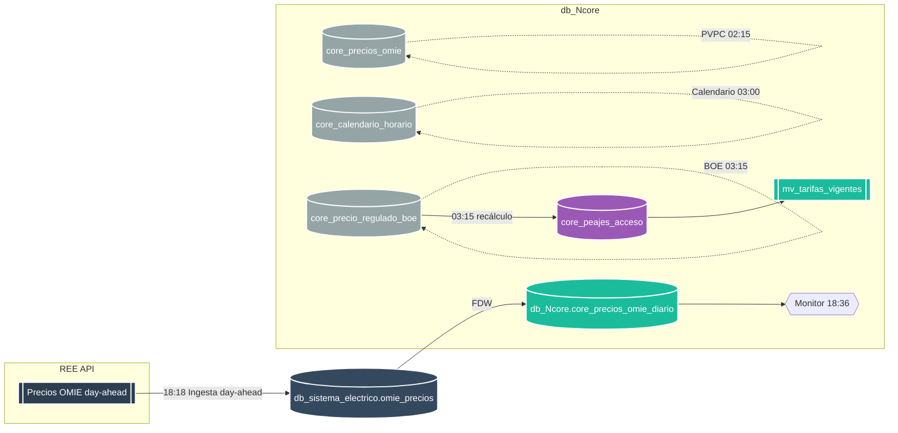

<p align="center">
  
</p>

# 🔄 Actualizaciones Automáticas de Precios y Referenciales


**Módulo:** db_watioverse (integración con Ncore y sistema eléctrico)

---

## 📑 Tabla de Contenidos

- [Descripción General](#-descripción-general)
- [Arquitectura del Sistema](#-arquitectura-del-sistema)
- [Planificación Automática (cron)](#-planificación-automática-cron)
- [Scripts y SQL implicados](#-scripts-y-sql-implicados)
- [Consultas de Verificación](#-consultas-de-verificación)
- [Notas de Operación](#-notas-de-operación)

## 🎯 Descripción General

Sistema automático para mantener actualizados los precios energéticos y referenciales asociados. El flujo integra la ingesta de precios OMIE (day-ahead), sincronización hacia Ncore, actualización de PVPC, calendario tarifario y BOE (peajes/cargos), con monitorización diaria.

## 🏗️ Arquitectura del Sistema



## ⏱️ Planificación Automática (launchd)

| Proceso | Hora | LaunchAgent |
|---|---:|---|
| Ingesta OMIE day-ahead (origen) con 3 reintentos x5' y post-sync | 18:18 | `com.vagalume.omie.ingest_dayahead` |
| Sincronización OMIE (Ncore, incluye mañana) | 18:31 | `com.vagalume.omie.sync_1640` |
| Monitor OMIE day-ahead (24h + agregado) | 18:36 | `com.vagalume.omie.monitor_1645` |
| Verificación nocturna OMIE (agregado) | 02:10 | `com.vagalume.omie.sync_0210` |
| PVPC horario (30d incremental) | 02:15 | `com.vagalume.pvpc.sync_0215` |
| Calendario tarifario (14d incremental) | 03:00 | `com.vagalume.calendario.sync_0300` |
| BOE upsert + recálculo P1..P6 | 03:15 | `com.vagalume.boe.sync_0315` |

Notas:
- OMIE publica los precios del día siguiente alrededor de las 16:30–17:00. Para evitar saturación, se programa la ingesta a las 18:18 con 3 intentos automáticos (cada 5 minutos) y sincronización inmediata a Ncore tras el primer intento exitoso.
- La sincronización de respaldo se ejecuta a las 18:31 y el monitor valida a las 18:36 (23–25 horas en origen y agregado en Ncore).
- La verificación nocturna a las 02:10 re-sincroniza por si hubiera revisiones.

## 🧩 Automatización instalada (LaunchAgents)

- Ingesta OMIE day-ahead (origen `db_sistema_electrico`) con 3 reintentos x5' y post-sync a Ncore:
  - `~/Library/LaunchAgents/com.vagalume.omie.ingest_dayahead.plist`

- Sincronización OMIE (Ncore):
  - `~/Library/LaunchAgents/com.vagalume.omie.sync_1640.plist` (18:31)
  - `~/Library/LaunchAgents/com.vagalume.omie.sync_0210.plist` (02:10)

- PVPC horario (Ncore):
  - `~/Library/LaunchAgents/com.vagalume.pvpc.sync_0215.plist`

- Calendario tarifario (Ncore):
  - `~/Library/LaunchAgents/com.vagalume.calendario.sync_0300.plist`

- BOE peajes/cargos (Ncore):
  - `~/Library/LaunchAgents/com.vagalume.boe.sync_0315.plist` (incluye recálculo y REFRESH `mv_tarifas_vigentes`)

Observación:
- Los LaunchAgents ejecutan one‑liners `psql`/`curl`/`jq` y no dependen de ficheros `.sh` o `.sql` del repositorio. Los nombres de BD y tablas son reales (sin alias) tal y como exige la operativa.

## 🔍 Consultas de Verificación

- Origen OMIE (day-ahead):

```sql
-- Debe devolver 23-25 filas para mañana (maneja DST)
SELECT fecha, COUNT(*)
FROM omie_precios
WHERE zona='ES' AND fecha = CURRENT_DATE + 1
GROUP BY fecha;
```

- Agregado diario Ncore (incluye mañana):

```sql
SELECT fecha, precio_medio_mwh, precio_max_mwh, precio_min_mwh
FROM core_precios_omie_diario
WHERE fecha BETWEEN CURRENT_DATE AND CURRENT_DATE + 1
ORDER BY fecha;
```

- Verificación PVPC (últimos 30 días):

```sql
SELECT MIN(timestamp_hora) AS min_ts, MAX(timestamp_hora) AS max_ts, COUNT(*) AS registros
FROM core_precios_omie
WHERE timestamp_hora >= CURRENT_DATE - INTERVAL '30 days';
```

## 🧭 Notas de Operación

- Bases de datos y tablas reales (sin alias):
  - Origen: `db_sistema_electrico.omie_precios` (EUR/kWh)
  - Ncore: `db_Ncore.core_precios_omie_diario` (EUR/MWh), `db_Ncore.core_precios_omie`, `db_Ncore.core_calendario_horario`, `db_Ncore.core_precio_regulado_boe`, `db_Ncore.core_peajes_acceso`, `db_Ncore.mv_tarifas_vigentes`.
- Unidades:
  - La API REE devuelve EUR/MWh. El origen se almacena en EUR/kWh (÷1000). Ncore agrega en EUR/MWh.
- Robustez:
  - Ingesta usa paquetes semanales con fallback diario y reintentos (backoff) + endpoint alternativo de REE.
- Seguridad de cron:
  - Todos los scripts `.sh` exportan PATH para ejecución correcta desde cron.

---

**Documento Confidencial y Propiedad de Energy Green Data.**

*La información contenida en este documento es de carácter reservado y para uso exclusivo de la organización. Queda prohibida su reproducción, distribución o comunicación pública, total o parcial, sin autorización expresa.*
