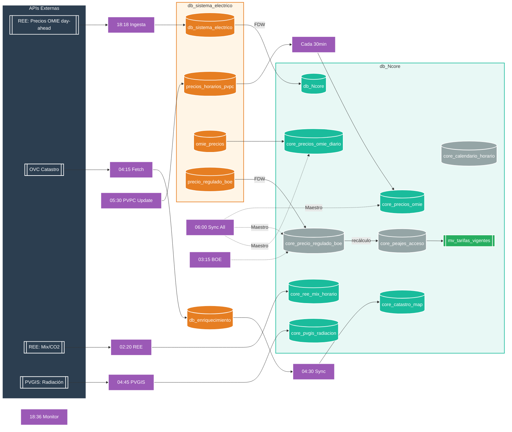

<p align="center">
  
</p>

# 🔄 Actualizaciones Automáticas de Precios y Referenciales


**Módulo:** db_watioverse (integración con Ncore y sistema eléctrico)

---

## 📑 Tabla de Contenidos

- [Descripción General](#-descripción-general)
- [Arquitectura del Sistema](#-arquitectura-del-sistema)
- [Planificación Automática (cron)](#-planificación-automática-cron)
- [Scripts y SQL implicados](#-scripts-y-sql-implicados)
- [Consultas de Verificación](#-consultas-de-verificación)
- [Notas de Operación](#-notas-de-operación)

## 🎯 Descripción General

Sistema automático para mantener actualizados los precios energéticos y referenciales asociados. El flujo integra la ingesta de precios OMIE (day-ahead), sincronización hacia Ncore, actualización de PVPC, calendario tarifario y BOE (peajes/cargos), con monitorización diaria.

## 🏗️ Arquitectura del Sistema



## ⏱️ Planificación Automática

### Jobs Críticos - Pipeline Ncore (Python/Cron)

| Proceso | Hora | Script | Función |
|---|---:|---|---|
| **PVPC Update sistema_electrico** | <span style="color:#9B59B6">**05:30**</span> | `update_pvpc_simple.py` | Actualiza precios_horarios_pvpc desde OMIE |
| **Sincronización Maestro** | <span style="color:#9B59B6">**06:00**</span> | `sync_all_to_ncore.py` | Sincronización completa sistema_electrico→Ncore |
| **PVPC Incremental** | <span style="color:#9B59B6">**Cada 30min**</span> | `backfill_pvpc_to_ncore.py` | Mantiene core_precios_omie al día (últimos 2 días) |
| **REE Mix/CO2** | <span style="color:#9B59B6">**Cada hora**</span> | `fetch_ree_mix_co2.py` | Mix generación y emisiones CO2 desde REE |
| **BOE Regulado** | <span style="color:#9B59B6">**Domingos 03:00**</span> | `sync_boe_to_ncore.py` | Sincroniza precios regulados BOE |
| **Códigos Postales** | <span style="color:#9B59B6">**Cada 6 meses**</span> | `ejecutar_poblado_cp.py` | Validación y actualización territorial |

### Jobs Legacy (LaunchAgents/psql)

| Proceso | Hora | LaunchAgent |
|---|---:|---|
| Ingesta OMIE day-ahead (origen) con 3 reintentos x5' y post-sync | <span style="color:#9B59B6">18:18</span> | `com.vagalume.omie.ingest_dayahead` |
| Sincronización OMIE (Ncore, incluye mañana) | <span style="color:#9B59B6">18:31</span> | `com.vagalume.omie.sync_1640` |
| Monitor OMIE day-ahead (24h + agregado) | <span style="color:#9B59B6">18:36</span> | `com.vagalume.omie.monitor_1645` |
| Verificación nocturna OMIE (agregado) | <span style="color:#9B59B6">02:10</span> | `com.vagalume.omie.sync_0210` |
| PVPC horario (30d incremental) | <span style="color:#9B59B6">02:15</span> | `com.vagalume.pvpc.sync_0215` |
| Calendario tarifario (14d incremental) | <span style="color:#9B59B6">03:00</span> | `com.vagalume.calendario.sync_0300` |
| BOE upsert + recálculo P1..P6 | <span style="color:#9B59B6">03:15</span> | `com.vagalume.boe.sync_0315` |
| Catastro cache OVC (50 CUPS/día con coord) | <span style="color:#9B59B6">04:15</span> | `com.vagalume.catastro.fetch_ovc` |
| Catastro diccionarios Ncore (64 usos oficiales) | <span style="color:#9B59B6">04:20</span> | `com.vagalume.catastro.build_dictionaries` |
| Catastro mapeo uso→categoría eSCORE | <span style="color:#9B59B6">04:25</span> | `com.vagalume.catastro.build_mapping` |
| Catastro promoción N2 (superficie kWh/m²) | <span style="color:#9B59B6">04:30</span> | `com.vagalume.catastro.fetch_n2` |
| REE mix/CO2 | <span style="color:#9B59B6">02:20</span> | `com.vagalume.ree.mixco2.ingest` |
| PVGIS irradiancia | <span style="color:#9B59B6">04:45</span> | `com.vagalume.pvgis.ingest` |
| Zonas climáticas HDD/CDD | <span style="color:#9B59B6">01:05</span> | `com.vagalume.zonas_climaticas.load_overnight` |

Notas:
- OMIE publica los precios del día siguiente alrededor de las 16:30–17:00. Para evitar saturación, se programa la ingesta a las 18:18 con 3 intentos automáticos (cada 5 minutos) y sincronización inmediata a Ncore tras el primer intento exitoso.
- La sincronización de respaldo se ejecuta a las 18:31 y el monitor valida a las 18:36 (23–25 horas en origen y agregado en Ncore).
- La verificación nocturna a las 02:10 re-sincroniza por si hubiera revisiones.

## 🧩 Automatización instalada

### Jobs Pipeline Ncore (Cron/Python) - NUEVOS ✨

Instalación rápida de todos los jobs:
```bash
bash /Users/vagalumeenergiamovil/PROYECTOS/Entorno/motores/db_watioverse/pipeline/Ncore/jobs/install_cron.sh
```

Scripts principales en `pipeline/Ncore/jobs/`:
- **`update_pvpc_simple.py`** - Actualiza precios_horarios_pvpc en sistema_electrico desde OMIE
- **`sync_all_to_ncore.py`** - Script maestro de sincronización completa (ejecuta todos los demás)
- **`backfill_pvpc_to_ncore.py`** - Backfill parametrizable por rango de fechas
- **`sync_boe_to_ncore.py`** - Sincroniza BOE regulado
- **`fetch_ree_mix_co2.py`** - Descarga mix generación y CO2 desde REE
- **`fetch_pvgis_radiation.py`** - Descarga radiación solar desde PVGIS

### LaunchAgents Legacy (macOS)

- Ingesta OMIE day-ahead (origen `db_sistema_electrico`) con 3 reintentos x5' y post-sync a Ncore:
  - `~/Library/LaunchAgents/com.vagalume.omie.ingest_dayahead.plist`

- Sincronización OMIE (Ncore):
  - `~/Library/LaunchAgents/com.vagalume.omie.sync_1640.plist` (18:31)
  - `~/Library/LaunchAgents/com.vagalume.omie.sync_0210.plist` (02:10)

- PVPC horario (Ncore):
  - `~/Library/LaunchAgents/com.vagalume.pvpc.sync_0215.plist`

- Calendario tarifario (Ncore):
  - `~/Library/LaunchAgents/com.vagalume.calendario.sync_0300.plist`

- BOE peajes/cargos (Ncore):
  - `~/Library/LaunchAgents/com.vagalume.boe.sync_0315.plist` (incluye recálculo y REFRESH `mv_tarifas_vigentes`)

- Catastro OVC (enriquecimiento → N2 + Ncore):
  - `~/Library/LaunchAgents/com.vagalume.catastro.fetch_ovc.plist` (04:15) - Cache OVC→db_enriquecimiento
  - `~/Library/LaunchAgents/com.vagalume.catastro.build_dictionaries.plist` (04:20) - 64 usos oficiales→Ncore
  - `~/Library/LaunchAgents/com.vagalume.catastro.build_mapping.plist` (04:25) - Mapeo uso→categoría eSCORE
  - `~/Library/LaunchAgents/com.vagalume.catastro.fetch_n2.plist` (04:30) - Promoción superficie→N2

- REE mix/CO2 (Ncore):
  - `~/Library/LaunchAgents/com.vagalume.ree.mixco2.ingest.plist` (02:20) - Mix generación y emisiones→Ncore

- PVGIS irradiancia (Ncore):
  - `~/Library/LaunchAgents/com.vagalume.pvgis.ingest.plist` (04:45) - Radiación mensual kWh/m²→Ncore

- Zonas climáticas HDD/CDD (Ncore):
  - `~/Library/LaunchAgents/com.vagalume.zonas_climaticas.load_overnight.plist` (01:05) - 11,830 CP con HDD/CDD→Ncore

- **Códigos Postales Territoriales (db_territorio):**
  - **Poblado masivo:** Sistema completo con 17,009 códigos postales de España (52 provincias)
  - **Validación automática:** Verificación de integridad y corrección de asociaciones erróneas
  - **Frecuencia recomendada:** **Cada 6 meses** (códigos postales cambian muy poco)
  - **Scripts disponibles:**
    - `motores/motor_extraccion/ejecutar_poblado_cp.py --modo validar` - Validación de integridad
    - `motores/motor_extraccion/ejecutar_poblado_cp.py --modo corregir` - Corrección automática
    - `motores/motor_extraccion/ejecutar_poblado_cp.py --modo completo` - Poblado completo (17K CPs)

Observación:
- Los nuevos jobs Python son idempotentes y manejan reintentos automáticos
- Los LaunchAgents legacy ejecutan one‑liners `psql`/`curl`/`jq`
- Todos usan nombres de BD y tablas reales (sin alias) tal y como exige la operativa

## ❓ ¿Por qué precargar en Ncore y no llamar a las APIs en tiempo real?

- Respuesta inmediata y estable: eSCORE (N3) lee N1+N2 locales, sin depender de latencias, timeouts o cuotas de terceros.
- Resiliencia: si REE/OMIE/OVC caen o limitan, el sistema sigue operativo con los datos ya precargados.
- Idempotencia y reproducibilidad: guardamos RAW+normalizado; mismo input ⇒ mismo resultado, con auditoría y re‑cálculo garantizado.
- Normalización multisource: unificamos unidades y reglas (p. ej., derivación CTE por altitud) antes de exponer a N3.
- Auditoría y trazabilidad: tablas `core_*` con timestamps explicables sin “viajar” a la API.
- Coste y gobernanza: menos llamadas repetidas; ventanas y frecuencias controladas por nosotros.
- Seguridad y cumplimiento: evitamos exponer PII a terceros en scoring; enriquecimiento controlado en N2.
- Escalabilidad: precómputo diario/horario sirve miles de scores concurrentes sin pegar a fuentes externas.
- Verificación automática: garantizamos cobertura (23–25 horas) y checks de integridad antes de publicar.
- Arquitectura por capas: N0→N1→N2→N3; N3 nunca habla con APIs, solo con datasets validados.

## 🔍 Consultas de Verificación

- Origen OMIE (day-ahead):

```sql
-- Debe devolver 23-25 filas para mañana (maneja DST)
SELECT fecha, COUNT(*)
FROM omie_precios
WHERE zona='ES' AND fecha = CURRENT_DATE + 1
GROUP BY fecha;
```

- Agregado diario Ncore (incluye mañana):

```sql
SELECT fecha, precio_medio_mwh, precio_max_mwh, precio_min_mwh
FROM core_precios_omie_diario
WHERE fecha BETWEEN CURRENT_DATE AND CURRENT_DATE + 1
ORDER BY fecha;
```

- Verificación PVPC (últimos 30 días):

```sql
-- Cobertura PVPC últimos 30 días (tabla de precio regulado en Ncore)
SELECT MIN(fecha_hora) AS min_ts, MAX(fecha_hora) AS max_ts, COUNT(*) AS registros
FROM core_precio_regulado_boe
WHERE fecha_hora >= CURRENT_DATE - INTERVAL '30 days';
```

- Verificación REE mix (tecnologías generación):

```sql
-- Mix horario por tecnología (ayer)
SELECT date(fecha_hora) AS dia, tecnologia, COUNT(*) AS horas, 
       ROUND(AVG(porcentaje),1) AS pct_medio
FROM core_ree_mix_horario
WHERE fecha_hora >= CURRENT_DATE - INTERVAL '1 day'
  AND fecha_hora < CURRENT_DATE
GROUP BY 1, 2
ORDER BY pct_medio DESC LIMIT 10;
```

- Verificación REE emisiones CO2:

```sql
-- Debe devolver 23-25 horas (maneja DST)
SELECT date_trunc('day', fecha_hora) AS dia, COUNT(*) AS horas,
       ROUND(AVG(gco2_kwh),1) AS gco2_medio
FROM core_ree_emisiones_horario
WHERE fecha_hora >= CURRENT_DATE - INTERVAL '1 day'
GROUP BY 1;
```

- Verificación PVGIS (irradiancia mensual):

```sql
-- Cobertura por mes y coords únicas
SELECT mes, COUNT(DISTINCT (latitud, longitud)) AS coords,
       ROUND(AVG(kwh_m2),1) AS kwh_m2_medio
FROM core_pvgis_radiacion
GROUP BY mes ORDER BY mes;
```

- Verificación zonas climáticas (HDD/CDD):

```sql
-- Distribución por provincia y zona CTE
SELECT provincia, zona_climatica_cte, COUNT(*) AS municipios,
       ROUND(AVG(hdd_anual_medio),0) AS hdd_medio,
       ROUND(AVG(cdd_anual_medio),0) AS cdd_medio
FROM core_zonas_climaticas
GROUP BY 1, 2
ORDER BY 1, 2;
```

- Verificación códigos postales territoriales:

```sql
-- Estado general de códigos postales por provincia
SELECT p.nombre_provincia, COUNT(lcp.codigo_postal) as total_cp,
       COUNT(DISTINCT l.nombre_localidad) as localidades_con_cp
FROM localidad_codigos_postales lcp
JOIN localidades l ON lcp.id_localidad = l.id_localidad
JOIN provincias p ON l.id_provincia = p.id_provincia
GROUP BY p.nombre_provincia, p.id_provincia
ORDER BY p.id_provincia;
```

```sql
-- Validación de integridad territorial (debe devolver 0 errores)
SELECT 'CP con formato incorrecto' as tipo_error, COUNT(*) as cantidad
FROM localidad_codigos_postales 
WHERE codigo_postal !~ '^[0-9]{5}$'
UNION ALL
SELECT 'CP fuera de rango español', COUNT(*)
FROM localidad_codigos_postales 
WHERE codigo_postal::integer NOT BETWEEN 1000 AND 52999
UNION ALL
SELECT 'Asociaciones geográficas erróneas', COUNT(*)
FROM localidad_codigos_postales lcp
JOIN localidades l ON lcp.id_localidad = l.id_localidad
WHERE LEFT(lcp.codigo_postal, 2)::integer != l.id_provincia;
```

## 🧭 Notas de Operación

- Bases de datos y tablas reales (sin alias):
  - Origen: `db_sistema_electrico.omie_precios` (EUR/kWh)
  - Ncore: `db_Ncore.core_precios_omie_diario` (EUR/MWh), `db_Ncore.core_precios_omie`, `db_Ncore.core_calendario_horario`, `db_Ncore.core_precio_regulado_boe`, `db_Ncore.core_peajes_acceso`, `db_Ncore.mv_tarifas_vigentes`.
- Unidades:
  - La API REE devuelve EUR/MWh. El origen se almacena en EUR/kWh (÷1000). Ncore agrega en EUR/MWh.
- Robustez:
  - Ingesta usa paquetes semanales con fallback diario y reintentos (backoff) + endpoint alternativo de REE.
- Seguridad de cron:
  - Todos los scripts `.sh` exportan PATH para ejecución correcta desde cron.

---

**Documento Confidencial y Propiedad de Energy Green Data.**

*La información contenida en este documento es de carácter reservado y para uso exclusivo de la organización. Queda prohibida su reproducción, distribución o comunicación pública, total o parcial, sin autorización expresa.*
