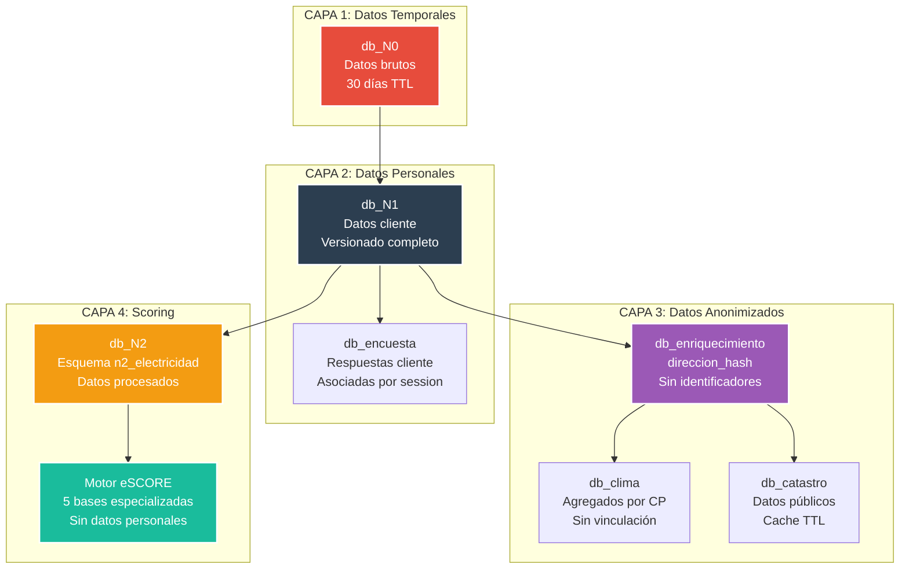
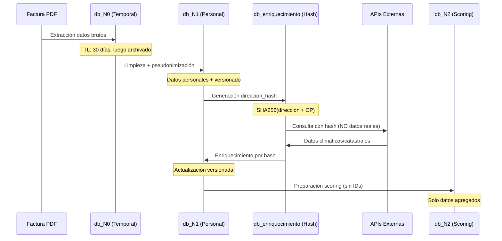
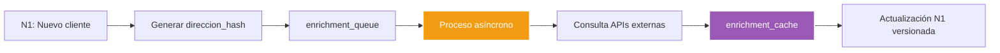

<p align="center">
  
</p>

# 🔒 Seguridad y Protección de Datos - Sistema Energético


**Módulo:** Seguridad y Protección de Datos  
**Proyecto interno de Energy Green Data**

---

## 📑 Tabla de Contenidos

- [Descripción General](#descripción-general)
- [Arquitectura de Seguridad](#arquitectura-de-seguridad)
- [Flujo de Protección de Datos](#flujo-de-protección-de-datos)
- [Sistema de Conexiones](#sistema-de-conexiones)
- [Enriquecimiento de Datos](#enriquecimiento-de-datos)
- [Control de Versiones](#control-de-versiones)

## 🎯 Descripción General

El sistema implementa una arquitectura multicapa de protección de datos personales que separa la información sensible del cliente de los datos de enriquecimiento externos. La arquitectura actual garantiza el cumplimiento del RGPD mediante separación física de bases de datos, pseudonimización y control granular de acceso.

### Arquitectura de Seguridad



## 🔄 Flujo de Protección de Datos

### Pipeline de Datos Seguros



### Separación de Responsabilidades por Base de Datos

| Base de Datos | Tipo de Datos | Protección Implementada | TTL |
|---------------|---------------|------------------------|-----|
| **db_N0** | Datos brutos + PII | Acceso restringido, archivado automático | 30 días |
| **db_N1** | Datos personales | Versionado, encriptación en tránsito | Permanente |
| **db_encuesta** | Respuestas cliente | Asociación por session_token | 1 año |
| **db_enriquecimiento** | Hashes + agregados | Sin vinculación directa a clientes | 90 días |
| **db_clima** | Datos meteorológicos | Agregados por código postal | 30 días |
| **db_catastro** | Datos públicos | Cache de APIs oficiales | 90 días |
| **db_N2** | Datos de scoring | Pseudonimizados para análisis | 2 años |

## 🔗 Sistema de Conexiones

### Gestor Centralizado de Conexiones

El archivo `db_connections.py` implementa un gestor singleton que controla el acceso a todas las bases de datos:

```python
# Configuración desde .env (credenciales protegidas)
base_config = {
    'host': os.getenv('DB_HOST'),
    'port': os.getenv('DB_PORT'), 
    'user': os.getenv('DB_USER'),
    'password': os.getenv('DB_PASSWORD')
}

# Pools optimizados por tipo de BD
if 'eSCORE' in db_name:
    min_conn, max_conn = 1, 50    # Consultas frecuentes
elif db_name in ['N0', 'N1', 'N2']:
    min_conn, max_conn = 2, 100   # Alta carga pipeline
else:
    min_conn, max_conn = 1, 20    # Auxiliares baja carga
```

### Características de Seguridad Implementadas

| Característica | Implementación | Estado |
|----------------|----------------|--------|
| **Credenciales externas** | Variables .env, nunca hardcodeadas | ✅ Activo |
| **Pools de conexiones** | Límites por tipo de BD, threading seguro | ✅ Activo |
| **Transacciones ACID** | Context managers con rollback automático | ✅ Activo |
| **Esquemas específicos** | N2 usa esquema n2_electricidad | ✅ Activo |
| **Sin fallbacks** | Fallos de BD críticas lanzan excepción | ✅ Activo |
| **Logging de acceso** | Registro de todas las operaciones | ✅ Activo |

### Configuración de Esquemas por Base de Datos

```python
# Configuración automática de esquemas
if db_name == 'N2':
    cursor.execute("SET search_path TO n2_electricidad, public;")

# Acceso controlado por tipo de operación
@contextmanager
def transaction(self, db_name: str):
    # Configuración específica por BD
    # Control de permisos granular
```

## 💎 Enriquecimiento de Datos

### Estrategia de Anonimización

El sistema de enriquecimiento opera sin acceso directo a datos personales:

```python
# Generación de hash para anonimización
direccion_hash = SHA256(direccion_completa + codigo_postal + salt)
cups_hash = SHA256(cups + fecha_vinculacion + salt)

# Cache multi-dimensional sin IDs reales
enrichment_cache(
    cups_hash,           # NUNCA el CUPS real
    direccion_hash,      # NUNCA la dirección real  
    tarifa,             # Dato técnico no personal
    periodo_mes         # Temporal, no identificativo
)
```

### APIs Externas Configuradas

| API | Tipo de Datos | Rate Limit | Datos Sensibles |
|-----|---------------|------------|-----------------|
| **AEMET** | Clima histórico/predicciones | 60/min | ❌ Solo códigos postales |
| **Catastro** | Características edificios | 100/min | ❌ Referencias catastrales |
| **OMIE** | Precios mercado eléctrico | 100/min | ❌ Datos públicos |
| **CNMC** | Tarifas reguladas | 30/min | ❌ Normativa pública |
| **REE** | Sistema eléctrico nacional | 100/min | ❌ Datos agregados |
| **INE** | Demografía territorial | 50/min | ❌ Estadísticas públicas |

### Proceso de Enriquecimiento Asíncrono



## 📊 Control de Versiones

### Sistema de Versionado en db_N1

Cada actualización de datos del cliente genera una nueva versión:

| Campo | Propósito | Ejemplo |
|-------|-----------|---------|
| **version_id** | Identificador único de versión | v1.2.3 |
| **enrichment_timestamp** | Última actualización externa | 2025-01-15 14:30:00 |
| **source_priority** | Jerarquía de fuentes | factura > enriquecimiento > estimación |
| **created_at** | Creación del registro | 2025-01-01 10:00:00 |
| **updated_at** | Última modificación | 2025-01-15 14:30:00 |
| **data_quality_score** | Puntuación de calidad | 98.7/100 |

### Trazabilidad Completa

```sql
-- Histórico completo de un cliente
SELECT version_id, source_priority, updated_at, data_quality_score
FROM client_versions 
WHERE client_id = 'hash_client_123'
ORDER BY version_id DESC;

-- Auditoría de enriquecimientos
SELECT enrichment_timestamp, api_source, success_rate
FROM enrichment_log
WHERE direccion_hash = 'sha256_direccion_456';
```

## 🛡️ Medidas de Seguridad Implementadas

### Nivel de Base de Datos

| Medida | Estado | Descripción |
|--------|--------|-------------|
| **Separación física** | ✅ Activo | 23 BDs independientes |
| **Acceso granular** | ✅ Activo | Permisos específicos por BD |
| **Encriptación en tránsito** | ✅ Activo | TLS para todas las conexiones |
| **Pools de conexiones** | ✅ Activo | Límites por tipo de carga |
| **Logging completo** | ✅ Activo | Registro de todas las operaciones |

### Nivel de Aplicación

| Medida | Estado | Descripción |
|--------|--------|-------------|
| **Variables de entorno** | ✅ Activo | Credenciales en .env |
| **Singleton thread-safe** | ✅ Activo | Una instancia de conexión |
| **Context managers** | ✅ Activo | RAII para transacciones |
| **Manejo de excepciones** | ✅ Activo | Sin fallbacks en BDs críticas |

## 📋 Roadmap de Seguridad

### Implementaciones Pendientes

| Característica | Prioridad | Estado | Fecha Objetivo |
|----------------|-----------|--------|----------------|
| **Encriptación en reposo** | Alta | 🔄 Planificado | Q1 2025 |
| **Rotación de salts** | Alta | 🔄 Planificado | Q1 2025 |
| **Auditoría RGPD** | Alta | 🔄 Planificado | Q2 2025 |
| **Backup cifrado** | Media | 🔄 Planificado | Q2 2025 |
| **Tokenización avanzada** | Media | 🔄 Planificado | Q3 2025 |
| **Right to be forgotten** | Media | 🔄 Planificado | Q3 2025 |

### Métricas de Seguridad Objetivo

| Métrica | Valor Actual | Objetivo |
|---------|--------------|----------|
| **Tiempo de response breach** | N/A | < 72 horas |
| **Datos pseudonimizados** | 60% | 95% |
| **APIs con rate limiting** | 100% | 100% |
| **Conexiones encriptadas** | 100% | 100% |
| **Bases con versionado** | 30% | 100% |

## 🔧 Configuración de Seguridad

### Variables de Entorno Requeridas

```bash
# Conexión a bases de datos
DB_HOST=localhost
DB_PORT=5432
DB_USER=postgres
DB_PASSWORD=admin

# Sales para hashing (NO COMMITEAR)
HASH_SALT_DIRECCION=random_salt_256_bits
HASH_SALT_CUPS=random_salt_256_bits

# APIs externas
AEMET_API_KEY=your_api_key
CATASTRO_API_TIMEOUT=30
OMIE_API_RATE_LIMIT=100
```

### Ejemplo de Uso Seguro

```python
from db_connections import db_manager, query

# Consulta con protección automática
resultados = query('N1', 
    'SELECT version_id, data_quality_score FROM client WHERE client_hash = %s',
    (client_hash,)
)

# Enriquecimiento asíncrono
with db_manager.transaction('enriquecimiento') as cursor:
    cursor.execute(
        'INSERT INTO enrichment_queue (direccion_hash, priority) VALUES (%s, %s)',
        (direccion_hash, 'high')
    )
```

---

**Documento Confidencial y Propiedad de Energy Green Data.**

*La información contenida en este documento es de carácter reservado y para uso exclusivo de la organización. Queda prohibida su reproducción, distribución o comunicación pública, total o parcial, sin autorización expresa.*
