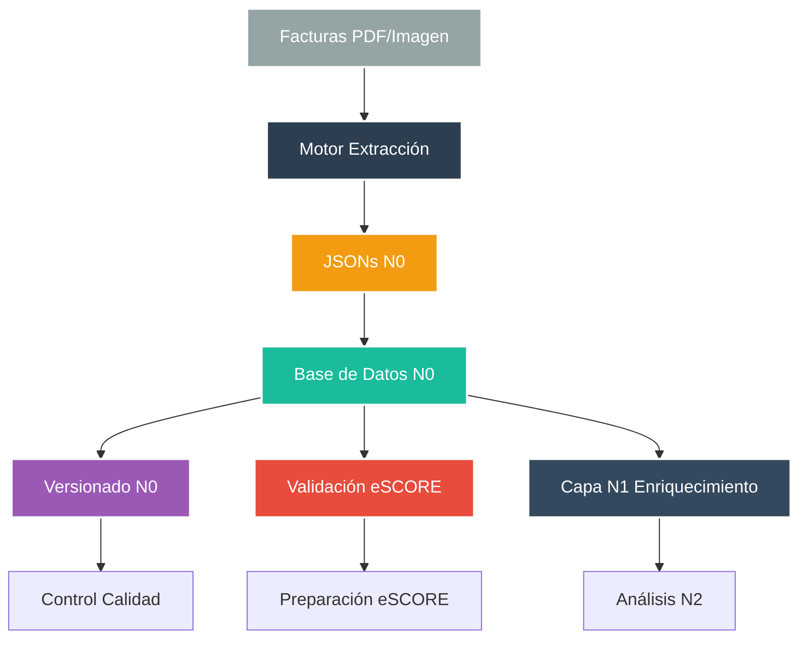
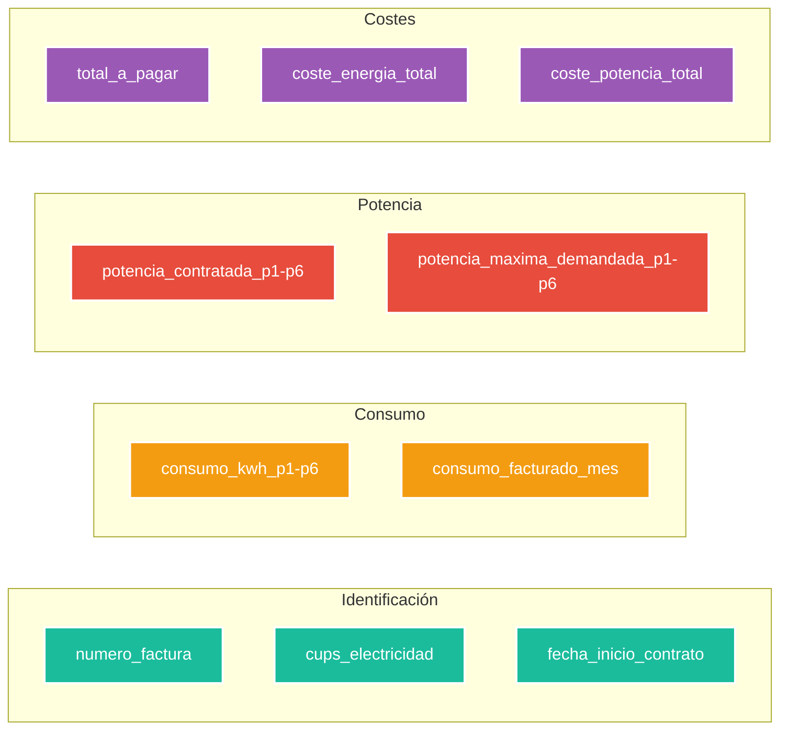
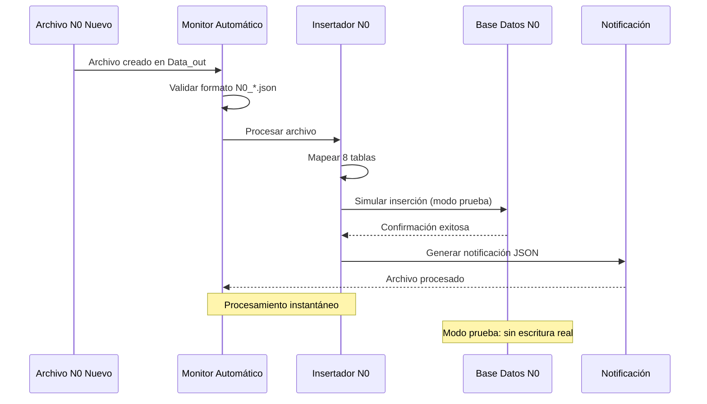
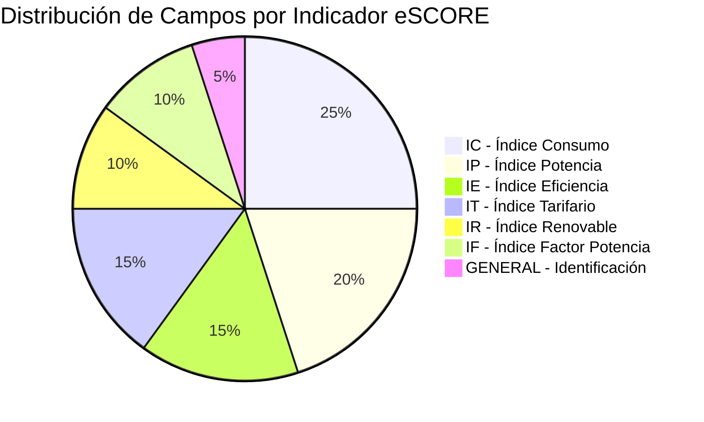
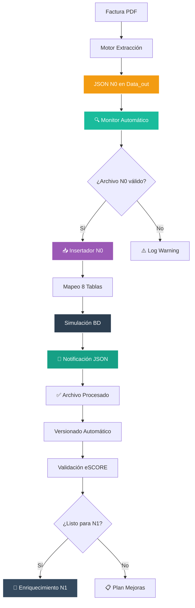
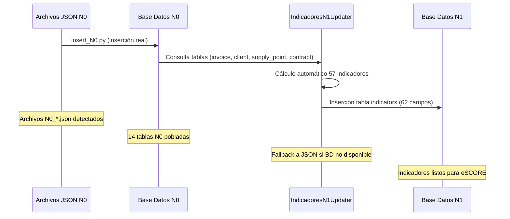

<p align="center">
  
</p>

# 💾 Base de Datos N0 - Capa de Datos en Bruto


**Módulo:** db_watioverse/N0  
**Proyecto interno de Energy Green Data**

---

## 📑 Tabla de Contenidos

- [Descripción General](#-descripción-general)
- [Arquitectura del Sistema](#-arquitectura-del-sistema)
- [Estructura de Base de Datos](#-estructura-de-base-de-datos)
- [Componentes de Versionado](#-componentes-de-versionado)
- [Validación y Preparación](#-validación-y-preparación)
- [Flujo de Datos](#-flujo-de-datos)

---

## 🎯 Descripción General

La **Base de Datos N0** constituye la capa fundamental del ecosistema de datos energéticos, almacenando información extraída directamente de facturas sin procesamiento adicional. Actúa como repositorio primario que alimenta las capas superiores N1 (enriquecimiento) y N2 (análisis) del sistema eSCORE.

### 🏗️ Arquitectura del Sistema



---

## 💾 Estructura de Base de Datos

### Tablas Principales

La base de datos N0 contiene **15 tablas especializadas** que almacenan todos los aspectos de las facturas energéticas (datos reales de MCP):

| Tabla | Campos Principales | Propósito |
|-------|-------------------|-----------|
| **`documents`** | `id`, `id_cups`, `client_id`, `provider_id` | Tabla maestra que relaciona todas las entidades |
| **`invoice`** | 200+ campos detallados | Datos completos de facturación por períodos |
| **`contract`** | `comercializadora`, `cups_electricidad`, `potencia_contratada_p1-p6` | Información contractual y potencias |
| **`supply_point`** | `cups`, `supply_address_id` | Puntos de suministro y ubicación |
| **`energy_consumption`** | `consumo_facturado_mes`, `precio_energia_eur_kwh` | Consumos y precios energéticos |
| **`power_term`** | `potencia_contratada_kw`, `precio_potencia_eur_kw_dia` | Términos de potencia y costes |
| **`client`** | `nombre_cliente`, `nif_titular_value` | Datos del titular del suministro |
| **`provider`** | `email_proveedor`, `datos_bancarios_iban` | Información del comercializador |

### Campos Críticos para eSCORE



---

## 🔄 Componentes de Versionado y Monitoreo

### Sistema de Control de Versiones

El directorio `data_versioning/` contiene herramientas especializadas para el control de calidad y evolución de los datos N0:

| Componente | Función | Archivo |
|------------|---------|---------|
| **Version Manager** | Detecta actualizaciones y mejoras en extracciones | `n0_version_manager.py` |
| **Field Mapper** | Mapea campos JSON a estructura de BD | `n0_field_mapper.py` |
| **Schema Validator** | Valida completitud de campos extraídos | `n0_schema_validator.py` |
| **Readiness Checker** | Verifica preparación para eSCORE | `n0_readiness_checker.py` |

### Sistema de Monitoreo Automático

| Componente | Función | Archivo |
|------------|---------|---------|
| **Monitor Automático** | Detecta archivos N0 nuevos en tiempo real | `monitor_n0_auto.py` |
| **Insertador N0** | Procesa y simula inserción en BD | `insert_N0.py` |
| **Entorno Virtual** | Dependencias aisladas (watchdog) | `../venv/` |

### Flujo de Monitoreo Automático



---

## ✅ Validación y Preparación

### Métricas de Preparación eSCORE

El sistema de validación evalúa la preparación de N0 para alimentar el sistema eSCORE mediante tres métricas clave:

| Métrica | Umbral Mínimo | Estado Actual |
|---------|---------------|---------------|
| **Campos Críticos** | 90% | ✅ 100.0% |
| **Campos Importantes** | 70% | ✅ 85.7% |
| **Cobertura Total** | 80% | ✅ 90.5% |

### Campos Verificados por Indicador



### Cobertura por Criticidad

- **🔴 Críticos (100%)**: `numero_factura`, `cups`, `consumo_facturado_kwh`, `potencia_contratada_kw`
- **🟡 Importantes (85.7%)**: `importe_total_factura`, `tarifa_acceso`, `provincia`, `codigo_postal`
- **🟢 Opcionales (Variable)**: `energia_reactiva_p1`, `autoconsumo_kwh`, `excedentes_kwh`

---

## 🔄 Flujo de Datos

### Pipeline Completo N0 con Monitoreo Automático



### Integración con Capas Superiores

La capa N0 alimenta directamente:

- **N1 (Indicadores Automáticos)**: IndicadoresN1Updater calcula 57 indicadores desde tablas N0
- **N2 (Análisis)**: Agregaciones y métricas eSCORE
- **Sistema eSCORE**: Indicadores IC, IP, IE, IT, IR, IF

### 📊 Pipeline Automático N0 → N1 (Producción)



## 🚀 Uso del Sistema de Monitoreo

### Activar Monitor Automático

```bash
# Desde el directorio db_watioverse
source venv/bin/activate
cd N0
python3 monitor_n0_auto.py
```

### Ejecutar Pipeline Completo N0 → N1

```bash
# Método principal: Motor de Actualizaciones
cd /Users/vagalumeenergiamovil/PROYECTOS/Entorno/motores/motor_actualizaciones
source venv/bin/activate
python -c "from updaters.indicadores_n1_updater import IndicadoresN1Updater; u = IndicadoresN1Updater(); print('Resultado:', u.run())"

# Verificar inserción en BD N1
python -c "
from core.db_manager import db_manager
with db_manager.get_connection('N1') as conn:
    with conn.cursor() as cursor:
        cursor.execute('SELECT COUNT(*) FROM indicators;')
        print(f'Indicadores calculados: {cursor.fetchone()[0]}')
"
```

### Ejemplo de Procesamiento Automático

**Archivo detectado**: `N0_ES0022000008342444ND1P_20250214_211038 copia.json`

```
✅ Procesamiento exitoso en 0.00s
📊 8 tablas insertadas (modo simulación):
   - documents: Registro maestro
   - client: Datos del titular
   - provider: Información comercializadora  
   - contract: Detalles contractuales
   - supply_point: Punto de suministro
   - supply_address: Dirección de suministro
   - energy_consumption: Consumos facturados
   - power_term: Términos de potencia
   - invoice: Datos de facturación

📄 Notificación: notificacion_n0_exito_20250906_005809.json
```

### Datos Procesados Automáticamente

- **Factura**: `1NSN250200317915`
- **CUPS**: `ES0022000008342444ND1P`
- **Consumo**: 121 kWh facturados
- **Potencia**: 2 kW contratados P1, 1 kW P2
- **Tarifa**: 2.0TD
- **Período**: 44 días (dic 2024 - feb 2025)
- **Importe**: 193.28€

### Cambiar a Modo Producción

Para inserción real en base de datos:

```python
# En monitor_n0_auto.py, línea 20
TEST_MODE = False  # Cambiar a False para producción
```

---

**Documento Confidencial y Propiedad de Energy Green Data.**

*La información contenida en este documento es de carácter reservado y para uso exclusivo de la organización. Queda prohibida su reproducción, distribución o comunicación pública, total o parcial, sin autorización expresa.*
