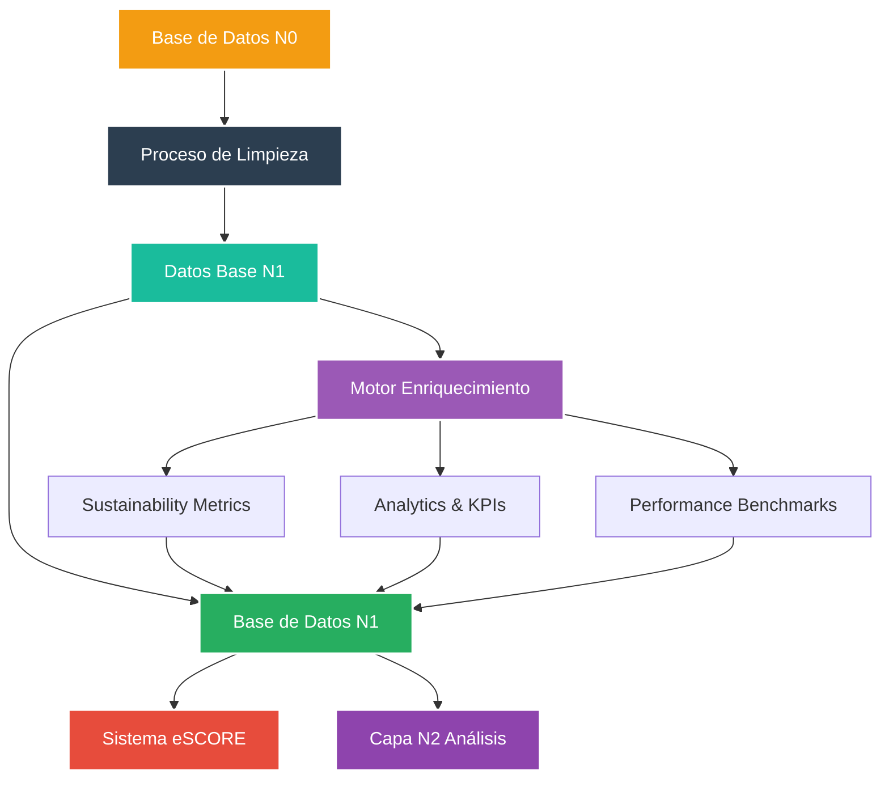
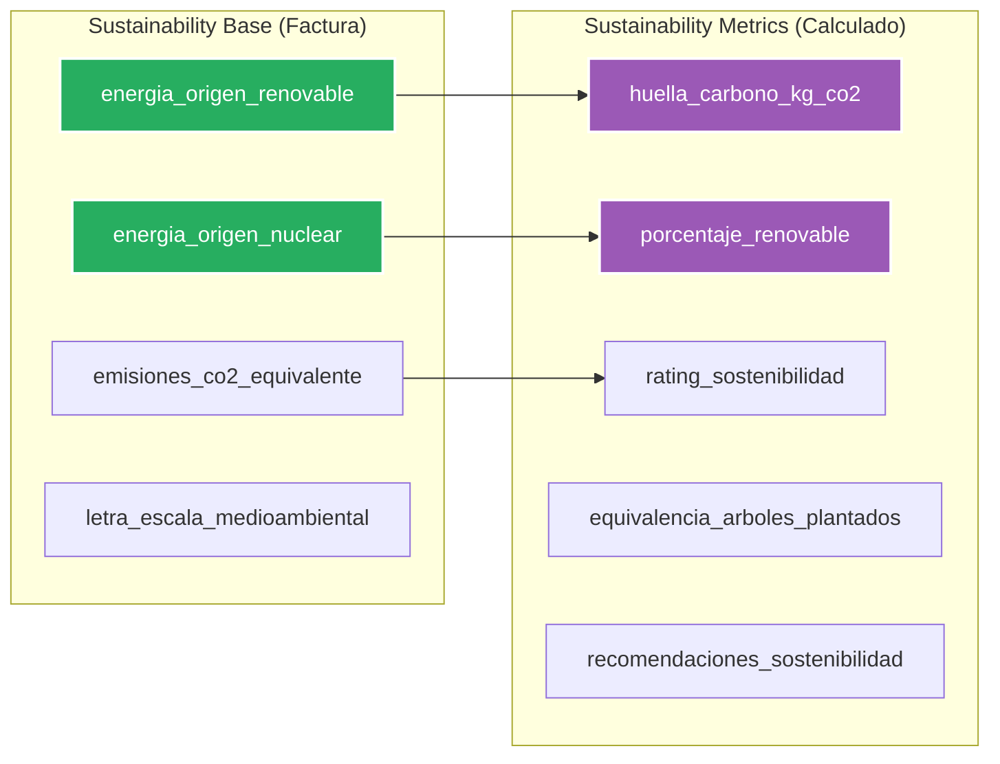
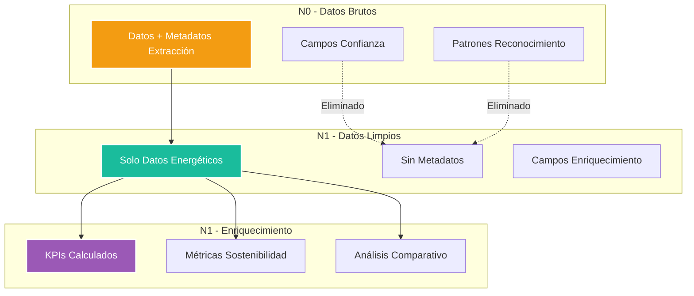
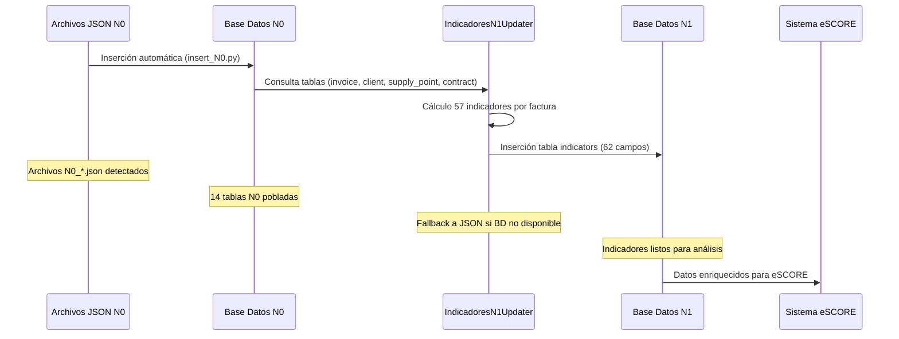
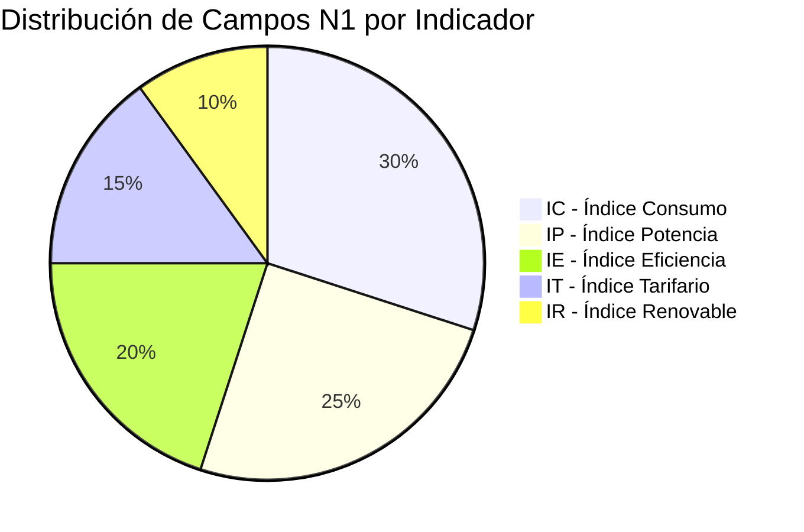

<p align="center">
  
</p>

# 🔄 Base de Datos N1 - Capa de Enriquecimiento Energético


**Módulo:** db_watioverse/N1  
**Proyecto interno de Energy Green Data**

---

## 📑 Tabla de Contenidos

- [Descripción General](#-descripción-general)
- [Arquitectura del Sistema](#-arquitectura-del-sistema)
- [Estructura de Base de Datos](#-estructura-de-base-de-datos)
- [Separación de Datos](#-separación-de-datos)
- [Flujo de Datos](#-flujo-de-datos)
- [Scripts de Creación](#-scripts-de-creación)

---

## 🎯 Descripción General

La **Base de Datos N1** constituye la capa de enriquecimiento del ecosistema de datos energéticos, transformando los datos en bruto de N0 en información analítica lista para el cliente. Elimina metadatos de extracción y añade KPIs, métricas de sostenibilidad y análisis comparativos para alimentar el sistema eSCORE.

### 🏗️ Arquitectura del Sistema



---

## 💾 Estructura de Base de Datos

### Arquitectura de Separación N1

La base de datos N1 implementa una **arquitectura de separación limpia** entre datos base y enriquecimiento:

| Categoría | Tablas | Propósito |
|-----------|--------|-----------|
| **📊 Datos Base** | 12 tablas | Datos limpios provenientes de N0 sin metadatos |
| **🌱 Sostenibilidad** | 2 tablas | Mix energético (base) + métricas calculadas |
| **📈 Enriquecimiento** | 1 tabla | KPIs, ratios y análisis comparativos |
| **🗂️ Control** | 2 tablas | Tabla maestra + control de traslado |

### Tablas de Datos Base (desde N0)

| Tabla | Campos Principales | Propósito |
|-------|-------------------|-----------|
| **`client`** | `nombre_cliente`, `nif_titular`, `tipo_cliente` | Datos del cliente sin metadatos |
| **`provider`** | `nombre_comercializadora`, `cif_comercializadora` | Información del proveedor |
| **`contract`** | `numero_contrato`, `tarifa_acceso`, `modalidad_contrato` | Datos contractuales |
| **`energy_consumption`** | `consumo_kwh_p1-p6`, `consumo_total_kwh` | Consumos energéticos base |
| **`invoice`** | `numero_factura`, `importe_total`, `precios_por_periodo` | Facturación completa |
| **`power_term`** | `potencia_contratada_p1-p6`, `potencia_facturada_p1-p6` | Términos de potencia |
| **`supply_point`** | `cups`, `numero_contador`, `tipo_contador` | Punto de suministro |
| **`metering`** | `lectura_anterior`, `lectura_actual`, `consumo_total_kwh` | Medición contadores |

### Tablas de Sostenibilidad (Mixto)



### Tabla de Enriquecimiento Puro

| Campo | Tipo | Propósito |
|-------|------|-----------|
| **`consumo_promedio_diario_kwh`** | DECIMAL | Promedio diario de consumo |
| **`coste_promedio_diario_eur`** | DECIMAL | Coste medio diario |
| **`eficiencia_energetica_ratio`** | DECIMAL | Ratio de eficiencia energética |
| **`ratio_coste_energia_potencia`** | DECIMAL | Relación coste energía/potencia |
| **`variacion_consumo_vs_mes_anterior`** | DECIMAL | Variación temporal consumo |
| **`periodo_mayor_consumo`** | VARCHAR | Período de mayor consumo (P1-P6) |
| **`alertas_consumo`** | TEXT[] | Alertas automáticas |
| **`recomendaciones_ahorro`** | TEXT[] | Recomendaciones personalizadas |
| **`percentil_consumo_sector`** | DECIMAL | Benchmarking sectorial |

### 📊 Tabla de Indicadores Automáticos (Producción)

La tabla **`indicators`** contiene **62 campos** calculados automáticamente desde los datos N0:

| Campo | Tipo | Propósito |
|-------|------|-----------|
| **`id_indicator`** | SERIAL | Identificador único del indicador |
| **`id_factura`** | VARCHAR | ID de factura origen |
| **`id_cliente`** | VARCHAR | ID de cliente |
| **`cups`** | VARCHAR | Código CUPS |
| **`año`** | INTEGER | Año de la factura |
| **`consumo_medido_min_p1-p6`** | DECIMAL | Consumo medido mínimo por período |
| **`consumo_medido_max_p1-p6`** | DECIMAL | Consumo medido máximo por período |
| **`consumo_facturado_min_p1-p6`** | DECIMAL | Consumo facturado mínimo por período |
| **`consumo_facturado_max_p1-p6`** | DECIMAL | Consumo facturado máximo por período |
| **`potencia_facturada_min_p1-p6`** | DECIMAL | Potencia facturada mínima por período |
| **`potencia_facturada_max_p1-p6`** | DECIMAL | Potencia facturada máxima por período |
| **`created_at`** | TIMESTAMP | Fecha de creación automática |
| **`metadata`** | JSONB | Metadatos del cálculo |

### 🤖 Cálculo Automático de Indicadores

El **IndicadoresN1Updater** procesa automáticamente:
- **Origen**: Tablas N0 (invoice, client, supply_point, contract)
- **Fallback**: Archivos JSON N0 si BD no disponible
- **Frecuencia**: Automático al detectar nuevos datos N0
- **Validación**: 80% de éxito mínimo requerido
- **Pipeline**: N0 → BD N0 → Indicadores N1 → BD N1

---

## 🔄 Separación de Datos

### Filosofía de Arquitectura



### Ventajas de la Separación

- **🧹 Claridad**: Datos originales vs calculados claramente diferenciados
- **⚡ Performance**: Consultas rápidas en datos base sin campos adicionales
- **🔧 Mantenimiento**: Regenerar enriquecimiento sin tocar datos base
- **📊 Auditoría**: Trazabilidad clara de origen vs cálculo
- **📈 Escalabilidad**: Enriquecimiento independiente y evolutivo

---

## 🔄 Flujo de Datos

### Pipeline Completo N0 → N1 (Automático)



### Transformaciones Clave

| Transformación | N0 → N1 | Propósito |
|----------------|---------|-----------|
| **Eliminación Metadatos** | `confianza_*`, `patron_*` → ❌ | Limpiar datos de extracción |
| **Campos Sostenibilidad** | Mix energético → `sustainability_base` | Datos directos de factura |
| **KPIs Calculados** | Consumos → Ratios y métricas | Enriquecimiento analítico |
| **Benchmarking** | Datos individuales → Comparativas | Análisis sectorial |

---

## 🛠️ Scripts de Creación

### Scripts Disponibles

| Script | Propósito | Estado |
|--------|-----------|--------|
| **`RECREAR_N1_SEPARADO.sql`** | Esquema con separación limpia | ✅ Listo |
| **`RECREAR_N1_UNIFICADO.sql`** | Esquema unificado (legacy) | ✅ Disponible |

### Ejecutar Creación de BD N1

```bash
# Opción 1: Esquema separado (recomendado)
psql -d db_N1 -f RECREAR_N1_SEPARADO.sql

# Opción 2: Esquema unificado
psql -d db_N1 -f RECREAR_N1_UNIFICADO.sql
```

### Resultado Esperado

```
✅ 17 tablas creadas:
   📊 12 tablas base (datos limpios)
   🌱 2 tablas sostenibilidad (base + métricas)
   📈 1 tabla analytics (enriquecimiento)
   🗂️ 2 tablas control (maestra + metadata)

✅ 8 índices de optimización
✅ Referencias y constraints
```

## 🚀 Ejecución Automática de Indicadores

### Comandos Principales (Producción)

```bash
# Activar entorno motor actualizaciones
cd /Users/vagalumeenergiamovil/PROYECTOS/Entorno/motores/motor_actualizaciones
source venv/bin/activate

# Ejecutar cálculo automático de indicadores N1
python -c "from updaters.indicadores_n1_updater import IndicadoresN1Updater; u = IndicadoresN1Updater(); print('Resultado:', u.run())"

# Verificar datos insertados en BD N1
python -c "
from core.db_manager import db_manager
with db_manager.get_connection('N1') as conn:
    with conn.cursor() as cursor:
        cursor.execute('SELECT COUNT(*) FROM indicators;')
        print(f'Indicadores en BD N1: {cursor.fetchone()[0]}')
"
```

### Comandos Legacy (db_watioverse)

```bash
# Activar entorno db_watioverse
cd /Users/vagalumeenergiamovil/PROYECTOS/Entorno/motores/db_watioverse
source .venv/bin/activate

# Pipeline completo N0 → N1 (método legacy)
python -m pipeline.N1.process_n1 --input-dir ../../../Data_out --output-dir ../../../Data_out
```

### Validación Post-Creación

```sql
-- Verificar tablas creadas
SELECT COUNT(*) as total_tables 
FROM information_schema.tables 
WHERE table_schema = 'public';

-- Verificar separación correcta
SELECT table_name 
FROM information_schema.tables 
WHERE table_schema = 'public' 
ORDER BY table_name;
```

---

## 🎯 Integración con eSCORE

La capa N1 alimenta directamente:

- **Sistema eSCORE**: Datos limpios + métricas enriquecidas
- **N2 (Análisis)**: Agregaciones y comparativas avanzadas
- **Dashboards Cliente**: KPIs y recomendaciones personalizadas

### Campos Críticos para eSCORE



---

**Documento Confidencial y Propiedad de Energy Green Data.**

*La información contenida en este documento es de carácter reservado y para uso exclusivo de la organización. Queda prohibida su reproducción, distribución o comunicación pública, total o parcial, sin autorización expresa.*
