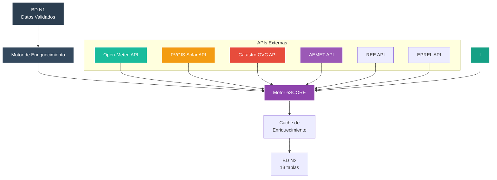
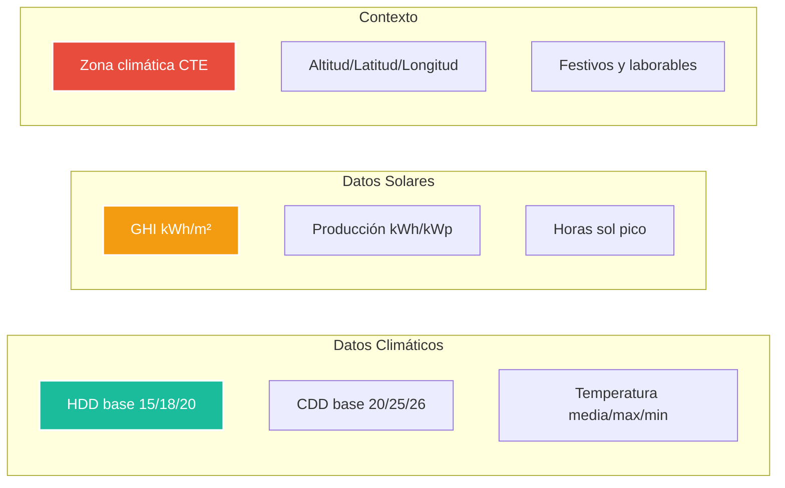
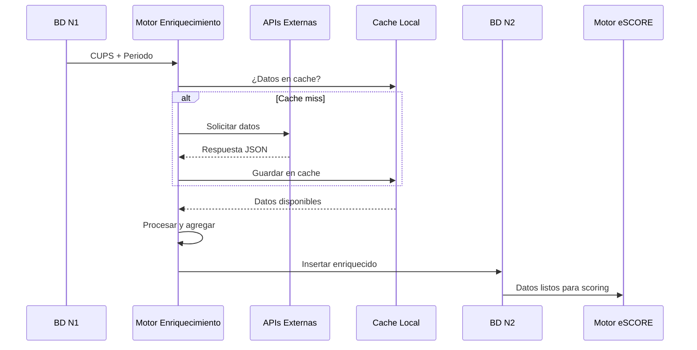

# 🌡️ Base de Datos N2 - Capa de Enriquecimiento Climático y Catastral


**Módulo:** Pipeline N2 - Enriquecimiento Climático, Catastral y Contextual  
**Proyecto interno de Energy Green Data**

---

## 📑 Tabla de Contenidos

- [Descripción General](#-descripción-general)
- [Arquitectura del Sistema](#-arquitectura-del-sistema)
- [Estructura de la Base de Datos](#-estructura-de-la-base-de-datos)
- [APIs Integradas](#-apis-integradas)
- [Flujo de Enriquecimiento](#-flujo-de-enriquecimiento)
- [Uso del Módulo](#-uso-del-módulo)

---

## 🎯 Descripción General

La base de datos N2 especializa en el enriquecimiento contextual con datos climáticos, solares, catastrales y geográficos. Integra múltiples APIs externas para proporcionar contexto ambiental y superficie construida necesarios para el cálculo de scores energéticos normalizados (kWh/m² año).

### Características Principales

| Característica | Valor | Descripción |
|----------------|-------|-------------|
| **Total de Tablas** | 13 | Especializadas en clima, catastro y contexto |
| **APIs Integradas** | 7 | Open-Meteo, PVGIS, Catastro OVC, AEMET, Nominatim, REE, EPREL (pendiente) |
| **Cobertura Temporal** | 366 días | Datos diarios completos |
| **Agregaciones** | Mensual | 13 meses de histórico |
| **Tiempo de Enriquecimiento** | <5s | Por CUPS completo |

---

## 🏗️ Arquitectura del Sistema



---

## 💾 Estructura de la Base de Datos

### Tablas Principales (13 tablas - datos MCP)

| Tabla | Columnas | Registros | Descripción |
|-------|----------|-----------|-------------|
| **clima_open_meteo** | 31 | 366 | Datos climáticos diarios |
| **clima_mensual_agregado** | 41 | 13 | Agregaciones mensuales HDD/CDD |
| **solar_mensual_agregado** | 22 | 12 | Producción solar potencial |
| **radiacion_pvgis** | 32 | 1 | Potencial fotovoltaico local |
| **coordenadas_geograficas_enriquecidas** | 41 | 1 | Geolocalización enriquecida |
| **contexto_factura_clima** | 20 | 0 | Contexto climático por factura |
| **datos_climaticos_mensuales** | 18 | 0 | Histórico mensual |
| **enrichment_cache** | 10 | 0 | Cache de consultas API |
| **enrichment_queue** | 13 | 0 | Cola de procesamiento |
| **facturas_electricidad_enriquecidas** | 23 | 0 | Facturas con contexto |
| **festivos_españa** | 13 | 15 | Calendario de festivos |
| **informe_contextual_factura** | 24 | 1 | Informes generados |
| **n2_catastro_inmueble** | 19 | Variable | Datos catastrales con superficie |

### Campos Clave para Normalización



---

## 🔌 APIs Integradas

### Open-Meteo (Clima Histórico)

| Campo | Unidad | Frecuencia | Uso en eSCORE |
|-------|--------|------------|---------------|
| **temperature_2m** | °C | Horaria | Normalización consumo |
| **relative_humidity** | % | Horaria | Ajuste confort |
| **precipitation** | mm | Diaria | Correlación demanda |
| **windspeed_10m** | km/h | Horaria | Factor renovable |
| **cloudcover** | % | Horaria | Potencial solar |

### PVGIS (Potencial Solar)

| Campo | Unidad | Descripción |
|-------|--------|-------------|
| **PVout** | kWh/kWp | Producción sistema FV |
| **GHI** | kWh/m² | Irradiación global horizontal |
| **DNI** | kWh/m² | Irradiación directa normal |
| **tilt_opt** | ° | Inclinación óptima |
| **azimuth_opt** | ° | Orientación óptima |

### Catastro (Inmueble)

| Campo | Tipo | Uso |
|-------|------|-----|
| **superficie_m2** | Numérico | Densidad energética |
| **año_construcción** | Entero | Eficiencia esperada |
| **uso_principal** | Categórico | Perfil consumo |
| **referencia_catastral** | String | Identificación única |

### AEMET (Predicción)

| Campo | Horizonte | Uso |
|-------|-----------|-----|
| **temperatura** | 7 días | Previsión demanda |
| **prob_precipitacion** | 7 días | Ajuste solar |
| **viento** | 7 días | Generación eólica |

---

## 🔄 Flujo de Enriquecimiento

### Pipeline N1 → N2



### Agregaciones Mensuales

| Métrica | Cálculo | Tabla Destino |
|---------|---------|---------------|
| **HDD mensual** | Σ max(0, Tbase - Tdiaria) | clima_mensual_agregado |
| **CDD mensual** | Σ max(0, Tdiaria - Tbase) | clima_mensual_agregado |
| **Radiación total** | Σ GHI diario | solar_mensual_agregado |
| **Producción FV** | kWh/kWp × días | solar_mensual_agregado |
| **Performance ratio** | Producción real / teórica | solar_mensual_agregado |

---

## ⚙️ Uso del Módulo

### Scripts Disponibles

| Script | Función | Ubicación |
|--------|---------|-----------|
| **enrich_climate.py** | Enriquecimiento climático | `/N2/` |
| **enrich_solar.py** | Datos solares PVGIS | `/N2/` |
| **aggregate_monthly.py** | Agregaciones mensuales | `/N2/` |
| **cache_manager.py** | Gestión de cache | `/shared/` |

### Configuración Requerida

```bash
# Base de datos
DB_N2_HOST=localhost
DB_N2_PORT=5432
DB_N2_NAME=db_N2
DB_N2_USER=postgres
DB_N2_PASSWORD=admin

# APIs
OPEN_METEO_URL=https://api.open-meteo.com/v1/
PVGIS_URL=https://re.jrc.ec.europa.eu/api/v5_2/
CATASTRO_URL=https://www1.sedecatastro.gob.es/
AEMET_API_KEY=xxx

# Cache
CACHE_TTL_DAYS=30
CACHE_MAX_SIZE_GB=10
```

### Ejemplo de Uso

```python
# Enriquecer datos de un CUPS
from N2.enrich_climate import ClimateEnricher

enricher = ClimateEnricher()
datos = enricher.enrich_cups(
    cups="ES0022000008433586LW0F",
    lat=40.4168,
    lon=-3.7038,
    periodo="2024-09"
)

# Resultado
{
    "hdd_15": 125.3,
    "cdd_25": 45.7,
    "temp_media": 18.5,
    "radiacion_total": 175.2,
    "produccion_fv_estimada": 145.8
}
```

---

## 📊 Métricas de Rendimiento

| Métrica | Valor Actual | Objetivo |
|---------|--------------|----------|
| **Hit rate cache** | 82% | >80% |
| **Tiempo enriquecimiento** | 4.2s | <5s |
| **Disponibilidad APIs** | 99.2% | >99% |
| **Completitud datos** | 95% | >90% |
| **Actualizaciones/día** | 150 | - |

---

**Documento Confidencial y Propiedad de Energy Green Data.**

*La información contenida en este documento es de carácter reservado y para uso exclusivo de la organización. Queda prohibida su reproducción, distribución o comunicación pública, total o parcial, sin autorización expresa.*
