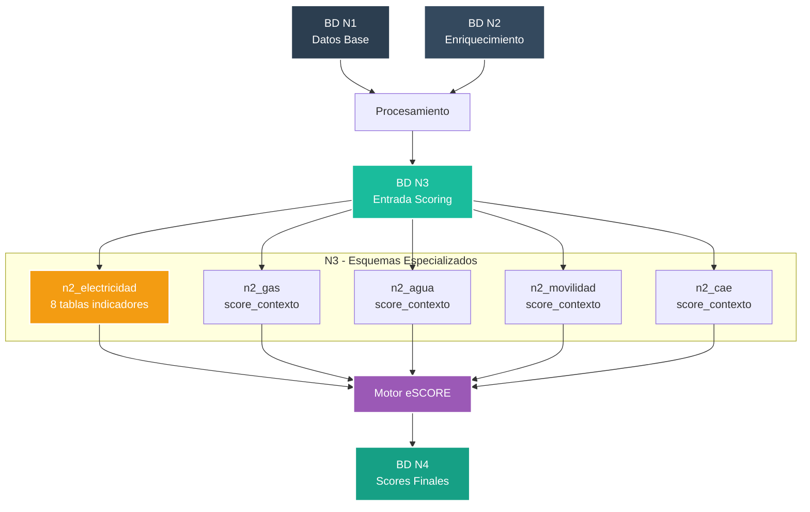
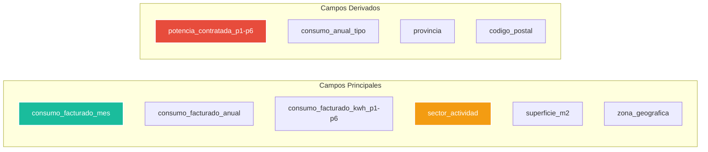
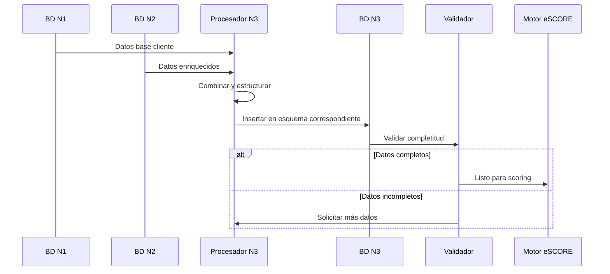

# 📊 Base de Datos N3 - Capa de Entrada para Scoring


**Módulo:** Pipeline N3 - Datos de Entrada para Motor eSCORE  
**Proyecto interno de Energy Green Data**

---

## 📑 Tabla de Contenidos

- [Descripción General](#-descripción-general)
- [Arquitectura del Sistema](#-arquitectura-del-sistema)
- [Estructura de la Base de Datos](#-estructura-de-la-base-de-datos)
- [Tablas por Indicador](#-tablas-por-indicador)
- [Flujo de Datos](#-flujo-de-datos)
- [Integraciones](#-integraciones)

---

## 🎯 Descripción General

La base de datos N3 almacena los datos preparados y estructurados específicamente para el cálculo de scores por el Motor eSCORE. Organiza la información en esquemas especializados por tipo de score (electricidad, gas, agua, movilidad, CAE).

### Características Principales

| Característica | Valor | Descripción |
|----------------|-------|-------------|
| **Total de Esquemas** | 5 | n2_electricidad, n2_gas, n2_agua, n2_movilidad, n2_cae |
| **Total de Tablas** | 16 | Distribuidas por tipo de score |
| **Índices Optimizados** | 37 | Solo en esquema electricidad |
| **Tiempo de Consulta** | <50ms | Para lookup por contexto_id |
| **Preparación Score** | 100% | Datos listos para cálculo |

---

## 🏗️ Arquitectura del Sistema



---

## 💾 Estructura de la Base de Datos

### Distribución por Esquemas (datos MCP)

| Esquema | Tablas | Propósito | Estado |
|---------|--------|-----------|--------|
| **n2_electricidad** | 11 | Datos para score eléctrico | ✅ Activo |
| **n2_gas** | 1 | Datos para score gas | ✅ Activo |
| **n2_agua** | 1 | Datos para score agua | ✅ Activo |
| **n2_movilidad** | 1 | Datos para score movilidad | ✅ Activo |
| **n2_cae** | 1 | Datos para score CAE | ✅ Activo |

### Esquema n2_electricidad (Detalle)

| Tabla | Columnas | Índices | Descripción |
|-------|----------|---------|-------------|
| **ic_data** | 24 | 15 | Índice de Consumo |
| **ip_data** | 20 | 5 | Índice de Potencia |
| **ir_data** | 15 | 2 | Índice de Renovables |
| **it_data** | 18 | 3 | Índice Tarifario |
| **ie_data** | 12 | 2 | Índice de Estacionalidad |
| **if_data** | 10 | 2 | Índice de Factor de Potencia |
| **ico_data** | 14 | 2 | Índice de Contratación |
| **ief_data** | 16 | 2 | Índice de Eficiencia |
| **score_contexto** | 8 | 5 | Contexto general |
| **electricidad_score_data** | 25 | 3 | Datos agregados |

---

## 📈 Tablas por Indicador

### IC - Índice de Consumo (ic_data)



### IP - Índice de Potencia (ip_data)

| Campo | Tipo | Descripción |
|-------|------|-------------|
| **potencia_contratada_maxima_kw** | NUMERIC | Potencia máxima contratada |
| **potencia_maxima_demandada_kw** | NUMERIC | Demanda máxima registrada |
| **factor_utilizacion** | NUMERIC | Ratio demanda/contratada |
| **excesos_potencia_count** | INTEGER | Número de excesos |
| **importe_excesos_eur** | NUMERIC | Coste por excesos |
| **importe_total_reactiva** | NUMERIC | Penalizaciones reactiva |

### Otros Indicadores (ir, it, ie, if, ico, ief)

Cada tabla contiene campos específicos para su indicador:
- **ir_data**: Datos de generación renovable y autoconsumo
- **it_data**: Información tarifaria y optimización
- **ie_data**: Patrones de estacionalidad
- **if_data**: Factor de potencia y calidad
- **ico_data**: Condiciones contractuales
- **ief_data**: Eficiencia energética

---

## 🔄 Flujo de Datos

### Pipeline N1+N2 → N3



### Proceso de Preparación

| Paso | Descripción | Tabla Destino |
|------|-------------|---------------|
| 1. **Extracción** | Lee datos de N1 y N2 | - |
| 2. **Combinación** | Une datos por contexto_id | - |
| 3. **Cálculo** | Genera métricas derivadas | - |
| 4. **Distribución** | Asigna a tabla de indicador | ic_data, ip_data, etc. |
| 5. **Validación** | Verifica completitud | score_contexto |
| 6. **Indexación** | Optimiza para consultas | Todos |

---

## ⚙️ Uso del Módulo

### Scripts Disponibles

| Script | Función | Ubicación |
|--------|---------|-----------|
| **prepare_ic_data.py** | Prepara datos IC | `/N3/electricidad/` |
| **prepare_ip_data.py** | Prepara datos IP | `/N3/electricidad/` |
| **validate_completeness.py** | Valida completitud | `/N3/shared/` |
| **create_context.py** | Genera contexto | `/N3/shared/` |

### Configuración Requerida

```bash
# Base de datos
DB_N3_HOST=localhost
DB_N3_PORT=5432
DB_N3_NAME=db_N3
DB_N3_USER=postgres
DB_N3_PASSWORD=admin

# Esquemas
SCHEMA_ELECTRICIDAD=n2_electricidad
SCHEMA_GAS=n2_gas
SCHEMA_AGUA=n2_agua
SCHEMA_MOVILIDAD=n2_movilidad
SCHEMA_CAE=n2_cae
```

### Consultas Optimizadas

```sql
-- Obtener datos para scoring eléctrico
SELECT 
    sc.contexto_id,
    sc.cliente_id,
    sc.cups,
    ic.*,
    ip.*,
    ir.*
FROM n2_electricidad.score_contexto sc
JOIN n2_electricidad.ic_data ic ON ic.contexto_id = sc.contexto_id
JOIN n2_electricidad.ip_data ip ON ip.contexto_id = sc.contexto_id
LEFT JOIN n2_electricidad.ir_data ir ON ir.contexto_id = sc.contexto_id
WHERE sc.cliente_id = $1
  AND sc.periodo_inicio >= $2;

-- Tiempo de respuesta: <50ms con índices
```

---

## 🔗 Integraciones

### Conexiones Upstream
- **N1**: Proporciona datos base validados
- **N2**: Aporta enriquecimiento climático y contextual

### Conexiones Downstream
- **Motor eSCORE**: Lee datos para cálculo de scores
- **N4**: Recibe scores calculados finales

### Validaciones Pre-Score

| Validación | Umbral | Estado Actual |
|------------|--------|---------------|
| **Campos críticos IC** | 100% | ✅ 100% |
| **Campos críticos IP** | 100% | ✅ 100% |
| **Contexto completo** | 95% | ✅ 98% |
| **Índices activos** | 37 | ✅ 37 |

---

## 📊 Métricas de Rendimiento

| Métrica | Valor Actual | Objetivo |
|---------|--------------|----------|
| **Tiempo preparación** | 1.2s | <2s |
| **Consultas concurrentes** | 50 | >40 |
| **Latencia p95** | 45ms | <50ms |
| **Disponibilidad** | 99.9% | >99.5% |

---

**Documento Confidencial y Propiedad de Energy Green Data.**

*La información contenida en este documento es de carácter reservado y para uso exclusivo de la organización. Queda prohibida su reproducción, distribución o comunicación pública, total o parcial, sin autorización expresa.*
