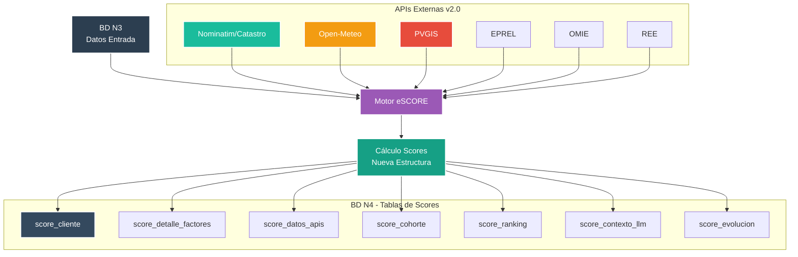
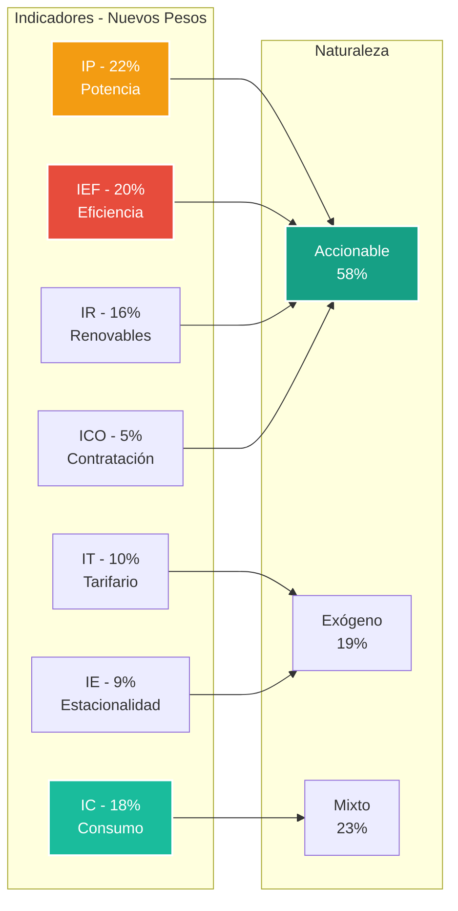
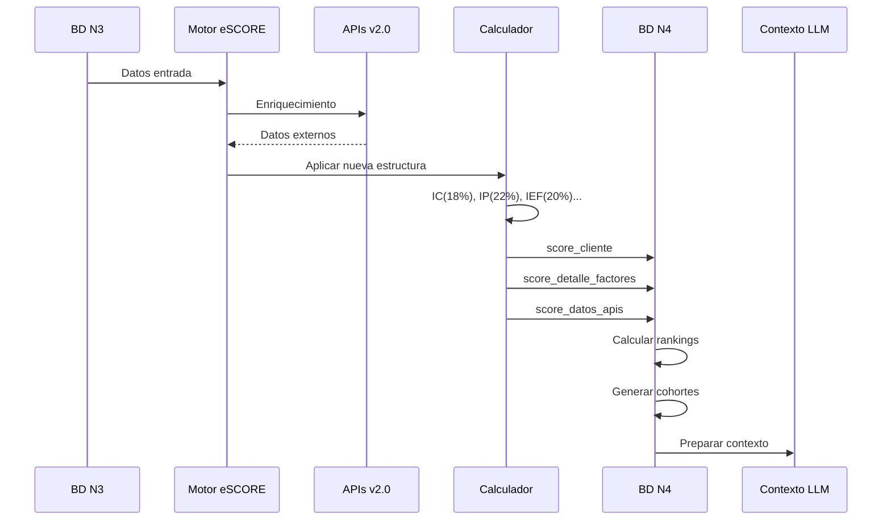

# 🏆 Base de Datos N4 - Scores Finales Calculados


**Módulo:** Pipeline N4 - Almacenamiento de Scores Finales  
**Proyecto interno de Energy Green Data**

---

## 📑 Tabla de Contenidos

- [Descripción General](#-descripción-general)
- [Arquitectura del Sistema](#-arquitectura-del-sistema)
- [Estructura de la Base de Datos](#-estructura-de-la-base-de-datos)
- [Integración con APIs](#-integración-con-apis)
- [Flujo de Scoring](#-flujo-de-scoring)
- [Uso del Módulo](#-uso-del-módulo)

---

## 🎯 Descripción General

La base de datos N4 almacena los scores finales calculados por el Motor eSCORE, incluyendo agregaciones mensuales, anuales, rankings, percentiles y contexto optimizado para LLM. Implementa la nueva estructura de indicadores con integración de 7 APIs externas.

### Características Principales

| Característica | Valor | Descripción |
|----------------|-------|-------------|
| **Total de Tablas** | 7 | Especializadas por tipo de agregación |
| **Índices Optimizados** | 21 | Para consultas de alta frecuencia |
| **APIs Integradas** | 7 | Nominatim, Catastro, Open-Meteo, PVGIS, EPREL, OMIE, REE |
| **Versión Cálculo** | v2.0 | Nueva estructura de pesos |
| **Tiempo de Consulta** | <100ms | Para scores por cliente |

---

## 🏗️ Arquitectura del Sistema



---

## 💾 Estructura de la Base de Datos

### Tablas Principales (7 tablas - verificadas MCP)

| Tabla | Columnas | Índices | Descripción |
|-------|----------|---------|-------------|
| **score_cliente** | 21 | 6 | Scores principales por cliente/periodo |
| **score_detalle_factores** | 15 | 1 | Detalle factores/subfactores con normalización |
| **score_datos_apis** | 25 | 1 | Datos obtenidos de APIs externas |
| **score_cohorte** | 24 | 4 | Agregaciones por sector/tarifa/zona |
| **score_ranking** | 18 | 3 | Rankings y percentiles |
| **score_contexto_llm** | 12 | 2 | Contexto pre-procesado para LLM |
| **score_evolucion** | 20 | 3 | Series temporales y tendencias |

### Nueva Estructura de Indicadores (v2.0)



---

## 🔌 Integración con APIs

### Datos Almacenados por API (score_datos_apis)

| API | Campos Clave | Uso en Score |
|-----|--------------|--------------|
| **Nominatim/Catastro** | superficie_m2, antiguedad_anio, uso_suelo | IC - densidad_energetica_kwh_m2 |
| **Open-Meteo** | hdd_mensual, cdd_mensual, temp_media | IE - estacionalidad_ajustada_clima |
| **PVGIS** | ghi_anual_kwh_m2, kwh_kwp_sistema, tilt_optimo | IR - cobertura_renovable_norm |
| **EPREL** | inventario_equipos, eei_medio | IEF - inventario_equipos_eprel |
| **OMIE** | precio_medio_periodo, percentil_p20, percentil_p80 | IT - respuesta_a_senal_precio |
| **REE** | demanda_MW_15m, intensidad_CO2 | IP - coincidencia_pico_sistema |

### Calidad y Completitud de Datos

```sql
-- Tabla score_datos_apis incluye metadatos de calidad
calidad_dato DECIMAL(3,2) -- 0-1 calidad del dato
estado_calidad VARCHAR(20) -- 'completo', 'parcial', 'fallback'
latencia_ms INT -- Tiempo de respuesta API
fecha_consulta TIMESTAMP -- Momento de obtención
```

---

## 🔄 Flujo de Scoring

### Pipeline N3 → eSCORE → N4



### Agregaciones y Cálculos

| Nivel | Tabla | Temporalidad | Métricas |
|-------|-------|--------------|----------|
| **Cliente** | score_cliente | Mensual | 7 indicadores + total |
| **Detalle** | score_detalle_factores | Por cálculo | Factores/subfactores normalizados |
| **Cohorte** | score_cohorte | Mensual | Media, mediana, percentiles |
| **Ranking** | score_ranking | Mensual | Percentiles por dimensión |
| **Evolución** | score_evolucion | Serie temporal | Tendencias, volatilidad |

---

## ⚙️ Uso del Módulo

### Scripts Disponibles

| Script | Función | Ubicación |
|--------|---------|-----------|
| **calculate_scores.py** | Cálculo principal | `/N4/` |
| **aggregate_cohortes.py** | Agregaciones por grupo | `/N4/` |
| **generate_rankings.py** | Rankings y percentiles | `/N4/` |
| **prepare_llm_context.py** | Contexto para LLM | `/N4/` |
| **analyze_evolution.py** | Análisis temporal | `/N4/` |

### Configuración Requerida

```bash
# Base de datos
DB_N4_HOST=localhost
DB_N4_PORT=5432
DB_N4_NAME=db_N4
DB_N4_USER=postgres
DB_N4_PASSWORD=admin

# Versión de cálculo
SCORE_VERSION=v2.0
USE_NEW_WEIGHTS=true

# APIs (heredadas de N2)
NOMINATIM_URL=https://nominatim.openstreetmap.org/
CATASTRO_URL=https://www1.sedecatastro.gob.es/
EPREL_URL=https://eprel.ec.europa.eu/api/
```

### Consultas Optimizadas

```sql
-- Score actual de un cliente
SELECT 
    sc.*,
    sr.percentil_global,
    sr.percentil_sector
FROM score_cliente sc
JOIN score_ranking sr ON 
    sr.cliente_id = sc.cliente_id 
    AND sr.periodo_mes = sc.periodo_mes
WHERE sc.cliente_id = $1
  AND sc.periodo_mes = $2;

-- Contexto para LLM
SELECT 
    resumen_ejecutivo,
    fortalezas,
    debilidades,
    oportunidades,
    recomendaciones
FROM score_contexto_llm
WHERE cliente_id = $1
  AND periodo_mes = $2;

-- Evolución temporal
SELECT 
    periodos_array,
    score_total_array,
    tendencia_12m,
    pendiente_regresion
FROM score_evolucion
WHERE cliente_id = $1;
```

---

## 📊 Métricas de Rendimiento

| Métrica | Valor Actual | Objetivo |
|---------|--------------|----------|
| **Tiempo cálculo score** | 3.5s | <5s |
| **Consultas/segundo** | 150 | >100 |
| **Latencia p95** | 95ms | <100ms |
| **Precisión score** | 98.5% | >95% |
| **Cobertura APIs** | 92% | >90% |

---

## 🚀 Características v2.0

### Nuevos Factores Integrados
- **densidad_energetica_kwh_m2** (IC)
- **inventario_equipos_eprel** (IEF) 
- **respuesta_a_senal_precio** (IT)
- **cobertura_renovable_norm** (IR) - Normalizada por PVGIS

### Mejoras de Normalización
- Zona climática CTE para comparables
- Percentiles móviles 6-12 meses para señales exógenas
- Cap máximo 97 puntos por subfactor
- Separación señales accionables vs exógenas

### Optimizaciones
- 21 índices especializados
- Cache de consultas frecuentes
- Paralelización de APIs
- Compresión JSONB para campos grandes

---

**Documento Confidencial y Propiedad de Energy Green Data.**

*La información contenida en este documento es de carácter reservado y para uso exclusivo de la organización. Queda prohibida su reproducción, distribución o comunicación pública, total o parcial, sin autorización expresa.*
