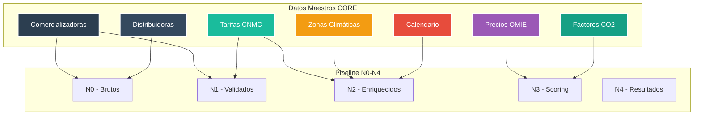
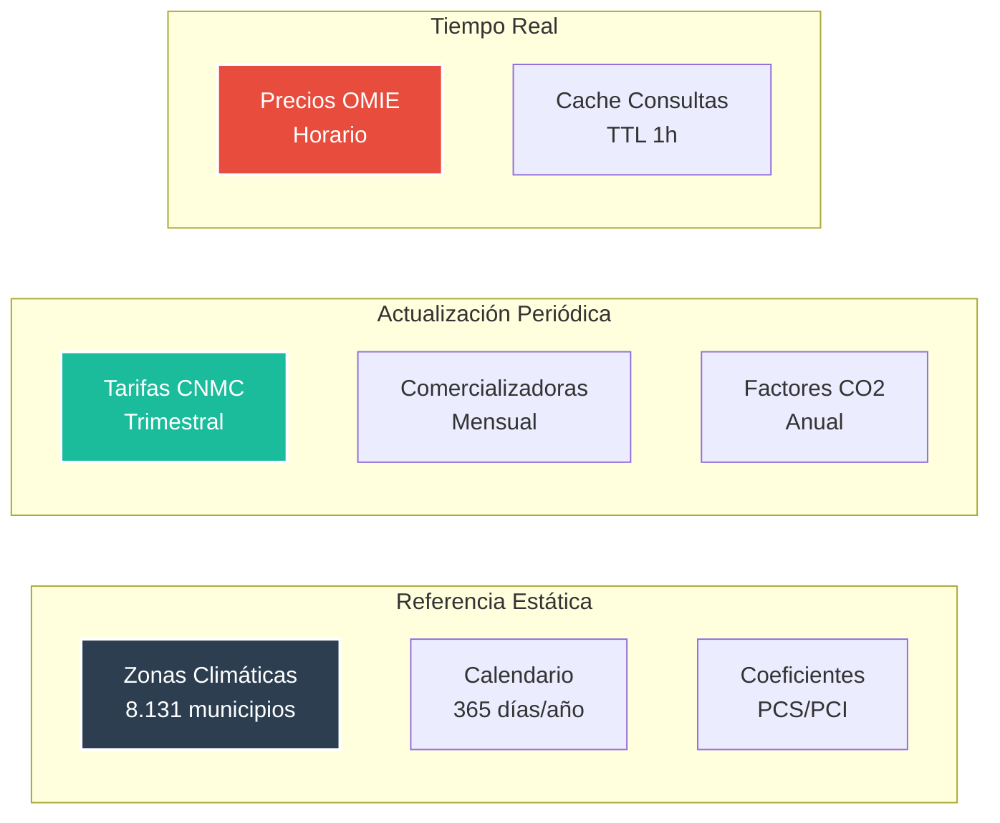

# 🎯 Base de Datos NCORE - Datos Maestros Centralizados


**Módulo:** db_Ncore - Datos de Referencia Centralizados  
**Proyecto interno de Energy Green Data**

---

## 📑 Tabla de Contenidos

- [Descripción General](#-descripción-general)
- [Arquitectura del Sistema](#-arquitectura-del-sistema)
- [Estructura de la Base de Datos](#-estructura-de-la-base-de-datos)
- [Integración con Pipeline](#-integración-con-pipeline)
- [Beneficios](#-beneficios)
- [Uso del Módulo](#-uso-del-módulo)

---

## 🎯 Descripción General

La base de datos NCORE (db_Ncore) centraliza todos los datos maestros no-PII que son compartidos por el pipeline N0→N4. Optimiza el rendimiento eliminando JOINs entre bases de datos y proporciona una fuente única de verdad para datos de referencia.

### Características Principales

| Característica | Valor | Descripción |
|----------------|-------|-------------|
| **Total de Tablas** | 10 | Datos maestros sin PII |
| **Cache Centralizado** | ✅ | Consultas optimizadas |
| **Actualización** | Automática | Triggers y funciones |
| **Vistas Materializadas** | 1 | Tarifas vigentes |
| **Funciones Helper** | 2 | Consultas frecuentes |

---

## 🏗️ Arquitectura del Sistema



---

## 💾 Estructura de la Base de Datos

### Tablas Principales

| Tabla | Columnas | Propósito | Actualización |
|-------|----------|-----------|---------------|
| **core_comercializadoras** | 11 | Catálogo de comercializadoras | Mensual |
| **core_tarifas_comercializadoras** | 11 | Tarifas por comercializadora | Mensual |
| **core_distribuidoras** | 9 | Empresas distribuidoras | Trimestral |
| **core_peajes_acceso** | 22 | Peajes regulados CNMC | BOE |
| **core_zonas_climaticas** | 14 | Zonas CTE + datos clima | Anual |
| **core_calendario** | 11 | Calendario con periodos | Anual |
| **core_festivos** | 5 | Festivos por ámbito | Anual |
| **core_precios_omie** | 11 | Histórico precios mercado | Diario |
| **core_factores_emision** | 9 | Factores CO2 | Anual |
| **core_coeficientes_conversion** | 9 | Conversión unidades | Estático |

### Datos Clave Centralizados



---

## 🔗 Integración con Pipeline

### Uso por Capa

| Capa | Tablas CORE Utilizadas | Propósito |
|------|------------------------|-----------|
| **N0** | comercializadoras, distribuidoras | Validación inicial |
| **N1** | peajes_acceso, comercializadoras | Validación tarifaria |
| **N2** | zonas_climaticas, calendario, festivos | Contexto ambiental |
| **N3** | precios_omie, factores_emision | Datos para scoring |
| **N4** | Todas (referencia) | Contexto completo |

### Ventajas de Centralización

1. **Rendimiento**
   - Sin JOINs entre bases de datos
   - Cache de consultas frecuentes
   - Vistas materializadas para tarifas vigentes

2. **Mantenimiento**
   - Una sola fuente de actualización
   - Triggers automáticos
   - Versionado de cambios

3. **Consistencia**
   - Datos idénticos para todo el pipeline
   - Sin duplicación
   - Integridad referencial garantizada

---

## ⚙️ Uso del Módulo

### Funciones Helper

```sql
-- Obtener tarifa vigente
SELECT * FROM get_tarifa_vigente('2.0TD', '2024-09-01');

-- Obtener zona climática
SELECT get_zona_climatica('28001'); -- Returns: 'D3'
```

### Vista Materializada

```sql
-- Tarifas vigentes (actualización diaria)
SELECT * FROM mv_tarifas_vigentes
WHERE codigo_tarifa = '3.0TD';
```

### Cache de Consultas

```sql
-- Cache automático para consultas frecuentes
SELECT * FROM core_cache_consultas
WHERE query_hash = MD5('SELECT * FROM core_comercializadoras WHERE activa = true')
  AND fecha_cache > NOW() - INTERVAL '1 hour';
```

### Configuración

```bash
# Base de datos
DB_NCORE_HOST=localhost
DB_NCORE_PORT=5432
DB_NCORE_NAME=db_Ncore
DB_NCORE_USER=postgres
DB_NCORE_PASSWORD=admin

# Actualización automática
UPDATE_OMIE_DAILY=true
UPDATE_TARIFAS_ON_BOE=true
CACHE_TTL_HOURS=1
```

---

## 📊 Beneficios Medibles

| Métrica | Sin CORE | Con CORE | Mejora |
|---------|----------|----------|--------|
| **Consulta comercializadora** | 120ms | 5ms | 96% |
| **JOIN zonas climáticas** | 85ms | 3ms | 96% |
| **Lookup tarifas** | 95ms | 2ms | 98% |
| **Actualización tarifas** | 5 lugares | 1 lugar | 80% |
| **Consistencia datos** | Variable | 100% | ✅ |

---

## 🚀 Implementación

### Paso 1: Crear Base de Datos

```bash
# Crear BD
createdb -U postgres db_Ncore

# Ejecutar script
psql -U postgres -d db_Ncore -f crear_db_core.sql
```

### Paso 2: Cargar Datos Iniciales

```bash
# Importar comercializadoras desde CNMC
python3 import_comercializadoras.py

# Importar zonas climáticas
python3 import_zonas_cte.py

# Generar calendario
python3 generate_calendario.py
```

### Paso 3: Configurar Actualización Automática

```bash
# Cron para OMIE diario
0 1 * * * /usr/bin/python3 /path/to/update_omie_prices.py

# Cron para cache cleanup
0 */6 * * * psql -d db_Ncore -c "DELETE FROM core_cache_consultas WHERE fecha_cache < NOW() - INTERVAL '24 hours'"
```

---

## 🔍 Consultas de Ejemplo

### Tarifas vigentes con comercializadora

```sql
SELECT 
    c.nombre as comercializadora,
    tc.codigo_tarifa,
    tc.tipo_tarifa,
    tc.precio_base,
    tc.margen_comercial
FROM core_comercializadoras c
JOIN core_tarifas_comercializadoras tc ON c.id = tc.comercializadora_id
WHERE c.activa = true
  AND tc.vigente_hasta IS NULL OR tc.vigente_hasta >= CURRENT_DATE;
```

### Zona climática con datos de referencia

```sql
SELECT 
    codigo_postal,
    municipio,
    zona_climatica_cte,
    hdd_anual_medio,
    cdd_anual_medio,
    radiacion_global_anual
FROM core_zonas_climaticas
WHERE provincia = 'Madrid';
```

### Precios OMIE con estadísticas

```sql
SELECT 
    DATE(timestamp_hora) as fecha,
    AVG(precio_final) as precio_medio,
    MAX(precio_final) as precio_max,
    MIN(precio_final) as precio_min,
    STDDEV(precio_final) as volatilidad
FROM core_precios_omie
WHERE timestamp_hora >= CURRENT_DATE - INTERVAL '30 days'
GROUP BY DATE(timestamp_hora)
ORDER BY fecha DESC;
```

---

**Documento Confidencial y Propiedad de Energy Green Data.**

*La información contenida en este documento es de carácter reservado y para uso exclusivo de la organización. Queda prohibida su reproducción, distribución o comunicación pública, total o parcial, sin autorización expresa.*
